# deepin v25 下 OpenClaw 安装教程 + 飞书接入

前段时间，clawdbot 爆火，直到现在热度仍然不减，甚至在某种程度上带动了苹果 Mac mini 的销量。不过，经历了这一年铺天盖地的 AI 资讯轰炸，我已经彻底放弃了对所谓“AI 热点”的持续追踪。这不，等我回过神来，clawdbot 都已经经历了几次改名，先是改名 Moltbot，寓意很好，但不好念，所以最终改名为 OpenClaw。

关于 OpenClaw 是什么、能做什么，相信大家早已被各种网络媒体反复科普，多少都有所了解。如果你到现在还没听说过 clawdbot 或 OpenClaw，那大概率说明你也不需要知道。

因此，这里不再重复这些背景介绍，只是单纯站在普通用户的视角，记录一下如何在国产操作系统 deepin v25 上安装 OpenClaw，并通过飞书完成接入。

本文虽然基于 deepin v25 所写，但适用与大部分 debian 系 Linux 系统，比如 Ubuntu、UOS 等。

## 一、升级 Node.js

deepin v25 仓库的 Node.js  版本为 18.19.1：
```bash
$ node -v
v18.19.1
```
而 OpenClaw 要求 Node.js 的版本为 22+，所以第一步来升级 Node.js。关于在 deepin 系统上升级 Node.js，我之前写过一篇教程：

[在 Deepin 系统中搭建 Node.js 开发环境](https://mp.weixin.qq.com/s/lVVMqkzJ6IOa6iJPch6UZA)

虽然这篇教程是针对 deepin v23 的，但在 deepin v25 上同样适用。

首先，安装 nvm，这是一个命令行工具，用于管理和切换不同版本的 Node.js 环境。通过 nvm，你可以轻松地安装多个版本的 Node.js，并在它们之间切换，无需手动删除和重新安装。

```bash
curl -o- https://raw.githubusercontent.com/nvm-sh/nvm/v0.40.4/install.sh | bash
```
接下来关闭当前终端窗口，然后打开一个新的终端窗口。然后安装 v22 版本 Node.js。

```bash
nvm install v22
```
安装完成后，确认是否已切换到新版本：
```bash
$ node -v
v22.22.0
$ npm -v
10.9.4
```

## 二、安装 OpenClaw

官方推荐方式，下载并执行脚本：

```bash
$ curl -fsSL https://openclaw.bot/install.sh | bash

  🦞 OpenClaw Installer
  I speak fluent bash, mild sarcasm, and aggressive tab-completion energy.

✓ Detected: linux
✓ Node.js v22.22.0 found
✓ Git already installed
→ Installing OpenClaw 2026.1.29...
```

安装完毕后，进入配置后会看到安全提示页：
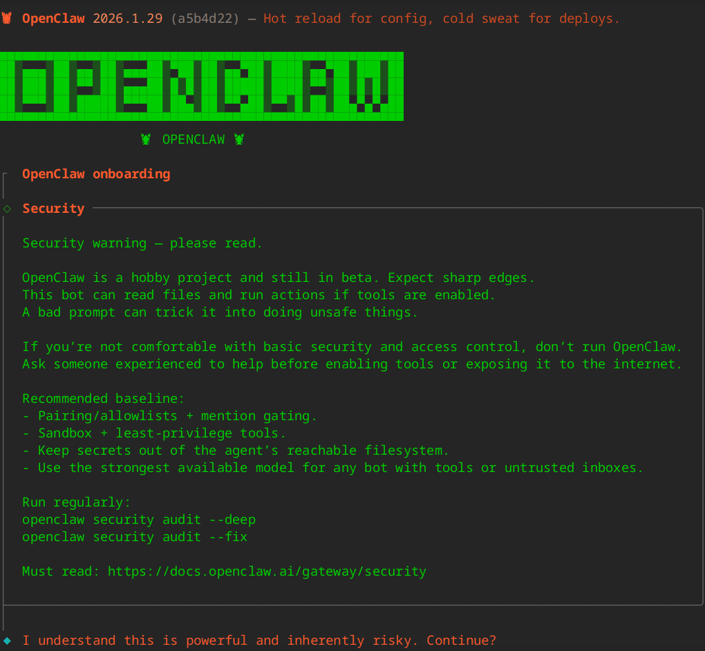

总结一下安全风险：

* OpenClaw 是测试阶段的业余项目，存在不稳定和安全风险。
* 启用工具后风险更高：它可以读文件、执行操作，恶意或不当提示可能诱导其做出不安全行为。
* 不具备基础安全能力的人不建议直接使用，尤其是在启用工具或对外暴露前，应请有经验的人协助。

所以不是专业人员，建议不要直接尝试。

在了解了安全风险后，选择 Yes 就可以继续往下了。

简单起见，Onboarding mode 选择 QuickStart。然后就是选择大模型提供商，国内的大模型可以选择 MinMax、Qwen（千问）、Moonshot AI（月之暗面）、Z.AI (GLM 4.7)（智谱）等。

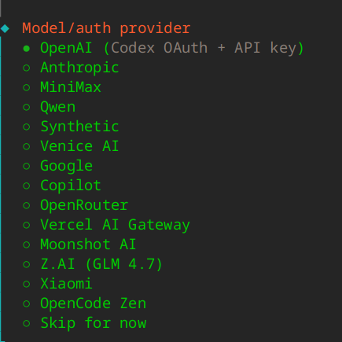

我之前使用过智谱的大模型，在编程能力方面还不错，所以这里就选择 Z.AI (GLM 4.7)，然后输入 API Key。

到这里，大模型配置部分就结束了，接下来就是配置 Channel:

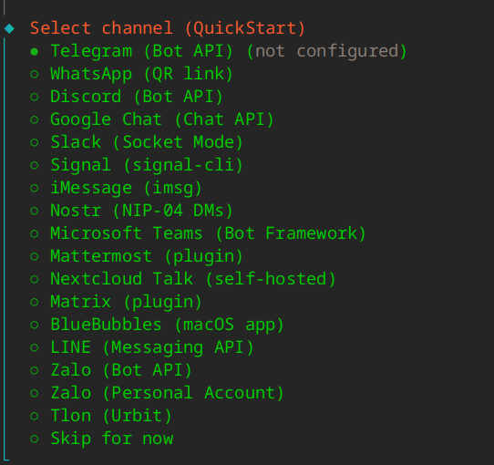

这里没有列出我们所要接入的飞书，所以选择最后一个选项，先暂时跳过这一步。

接下来就是配置 Skills。OpenClaw 的 Skills = AI 的“动手能力模块”。没有 Skills，它只能聊天。而有了 Skills，它就可以执行命令、读写文件、调用 API。

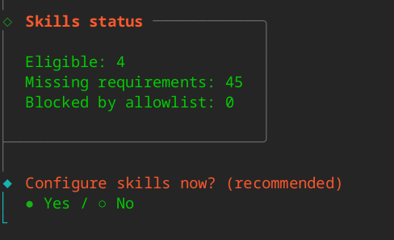

Skill 能做下面的事情：

* 系统操作	执行命令、重启服务
* 文件操作	读 / 写文件
* 网络请求	HTTP / API
* 自动化	浏览器操作、脚本执行
* 运维集成	部署、监控、日志
...

这里当然选择 Yes，要不它与一般的 AI 聊天工具就没有两样了。

接着往下走，提示安装 Homebrew，按照提示的命令，另外开一个终端，执行如下命令：

```bash
/bin/bash -c "$(curl -fsSL https://raw.githubusercontent.com/Homebrew/install/HEAD/install.sh)"
```
安装后有如下提示：
```
Warning: /home/linuxbrew/.linuxbrew/bin is not in your PATH.
  Instructions on how to configure your shell for Homebrew
  can be found in the 'Next steps' section below.
```
这是由于 Homebrew 安装到了 /home/linuxbrew/.linuxbrew/ 下，需要按照提示做一些配置：

```bash
    echo >> /home/uos/.bashrc
    echo 'eval "$(/home/linuxbrew/.linuxbrew/bin/brew shellenv bash)"' >> /home/uos/.bashrc
    eval "$(/home/linuxbrew/.linuxbrew/bin/brew shellenv bash)"
```

安装完毕 Homebrew 后，再回到 OpenClaw，继续配置。接着选择 npm 作为 node 包管理器。

最后选择 Skills 依赖：

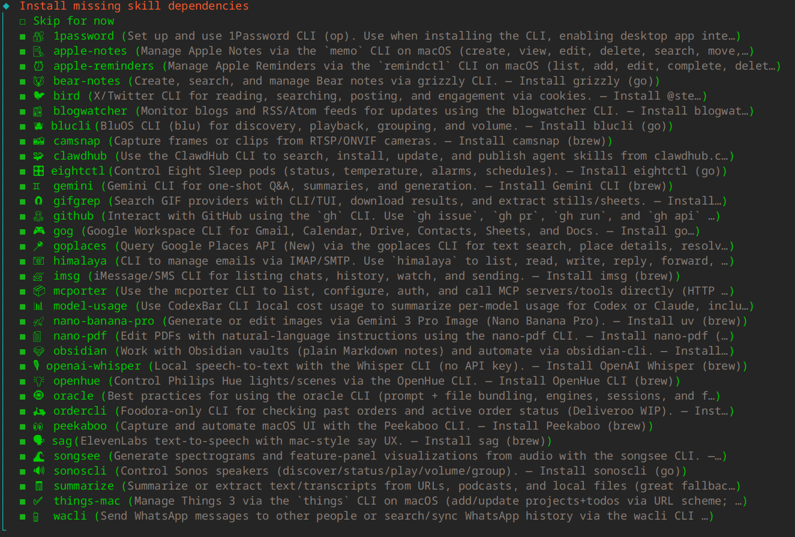

我这里就懒得做选择了，全部安装。这里有个小技巧，按空格键选中。由于上一步安装 Homebrew 是新开的终端安装的，其环境变量在这里还没生效，所以会提示：
```
 Install failed: 1password — brew not installed
Tip: run `openclaw doctor` to review skills + requirements.
Docs: https://docs.openclaw.ai/skills
```
先暂时忽略。接下来提示配置 GOOGLE_PLACES_API_KEY、GEMINI_API_KEY 等，先跳过。

然后询问是否启用 Hooks。这里 Hook 的概念应该类似 Git hook，就是在执行某些指令时，自动执行后台动作。


* boot-md：	          启动时先读一段规则
* command-logger：记录你对 Agent 的指令
* session-memory： 保存当前会话到长期记忆

不管三七二十一，都选上吧。后续可以通过如下命令管理 hooks：

```
openclaw hooks list                                     
openclaw hooks enable <name>                            
openclaw hooks disable <name>
```
接下来会安装系统服务：lingering 和 Gateway。这个是自动进行的。

再往后是一大箩筐的提示：


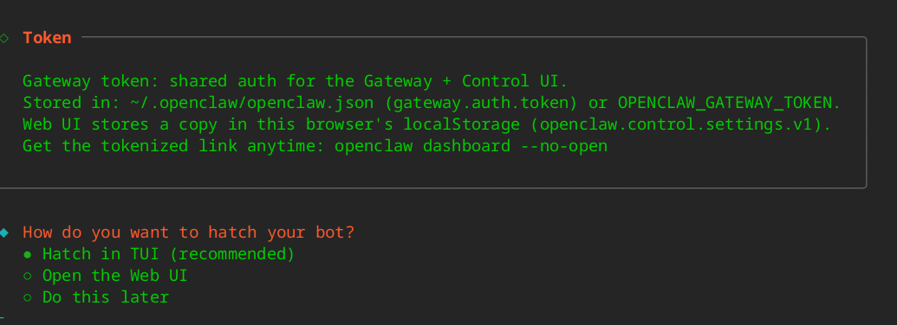

按回车，又是一大堆提示：

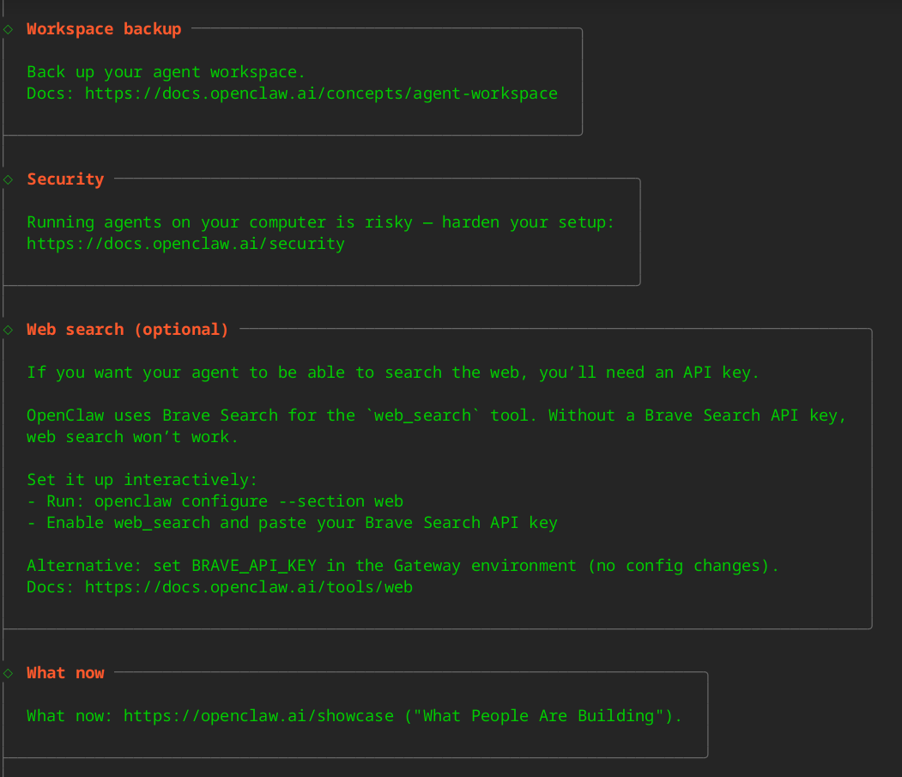

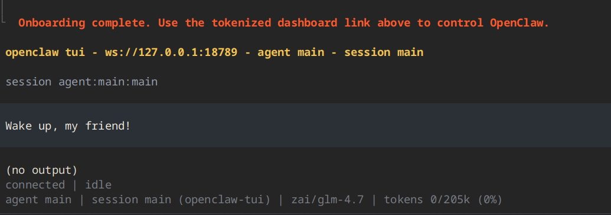

到这里，总算把 OpenClaw 配置完毕了。在这个界面就可以和 AI 进行对话。但我们的目标是接入飞书，所以按两次 ctrl ^ c，先退出这个界面。

## 三、配置飞书

### 3.1 安装飞书插件

直接输入如下命令安装飞书插件：

```
$ openclaw plugins install @m1heng-clawd/feishu

🦞 OpenClaw 2026.1.29 (a5b4d22) — Meta wishes they shipped this fast.

Downloading @m1heng-clawd/feishu…
Extracting /tmp/openclaw-npm-pack-T0pzzA/m1heng-clawd-feishu-0.1.4.tgz…
Installing to /home/uos/.openclaw/extensions/feishu…
Installing plugin dependencies…
Installed plugin: feishu
Restart the gateway to load plugins.
```

等待系统自动拉取安装依赖，当看到飞书插件安装成功的提示，即表示第一步安装完成。根据提示，重启 openclaw gateway：

```
openclaw gateway restart
```

### 3.2 配置飞书插件

在浏览器中输入 https://open.feishu.cn/app 进入飞书的开发者后台。创建一个应用，比如我给应用取名 “openclaw机器人”。创建完成后，进入应用的 `凭证与基础信息` 页，记下应用的 appid 和 app secret。

接下来给飞书插件配置 appid 和 app secret。这里我们体验使用 openclaw 的机器人来配置。

按照前面的 openclaw 的安装最后步骤的Web UI地址，打开浏览器，打开 Web UI。

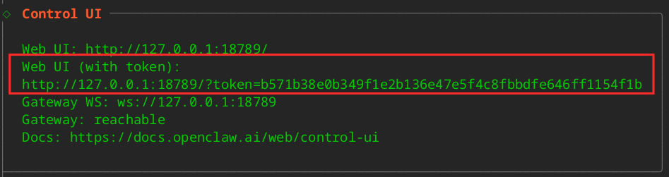

进入 Chat 界面，发出配置指令：

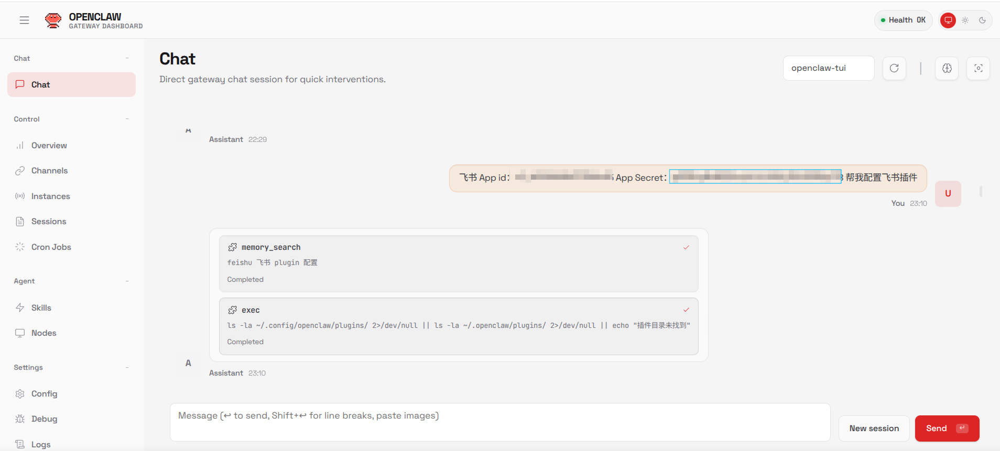

后面还有一堆回复，配置成功了没有呢？AI 认为配置成功了，但实际并非如此，还是手动配置吧：

```
# 设置飞书应用的 App ID
openclaw config set channels.feishu.appId "cli_xxxx"
# 设置飞书应用的 App Secret
openclaw config set channels.feishu.appSecret "your_app_secret"
# 启用飞书通道
openclaw config set channels.feishu.enabled true
# 重启 openclaw gateway
openclaw gateway restart
```

然后通过以下命令验证配置状态：

```
openclaw status
```

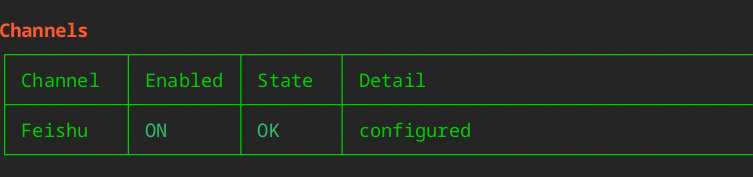

如果飞书通道显示为 `ON` 和 `OK` 状态，说明配置已成功加载。

### 3.3 配置飞书应用

接着进入飞书的开发者后台，完成以下关键配置，让插件正常收发消息 。

1. **添加应用能力**：在应用详情页的 `应用能力` 部分，**必须为应用添加“机器人”能力** 。

   

2. **开通API权限**：在 `权限管理` 页面，搜索并开通以下核心权限 ：

   - `contact:user.base:readonly`(获取用户信息)
   - `im:message`(收发消息)
   - `im:message.p2p_msg:readonly`(接收单聊消息)
   - `im:message.group_at_msg:readonly`(接收群聊@消息)
   - `im:message:send_as_bot`(以机器人身份发送消息)

3. **事件订阅**：在 `事件与回调` 页面 ：

   - **订阅方式**：选择“**长连接（WebSocket）**”。

   - **添加事件**：至少需添加 `im.message.receive_v1`（接收消息事件）等。

   - **添加回调**：至少添加 `card.action.trigger` (卡片回传交互) 和 `profile.view.get` (查看自定义名片页卡片)。

     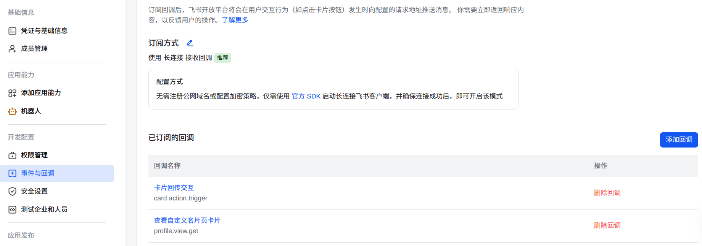

4. **发布应用**：最后，在 `版本管理与发布` 中创建版本并发布应用。发布后，才能在飞书客户端中搜索到你的机器人并进行测试 。

### 3.4 和 openclaw 机器人对话

打开飞书 App，打开我创建的 `openclaw机器人` 应用，在对话框中输入问题，比如：“武汉天气怎么样？” 机器人就会给与回复。

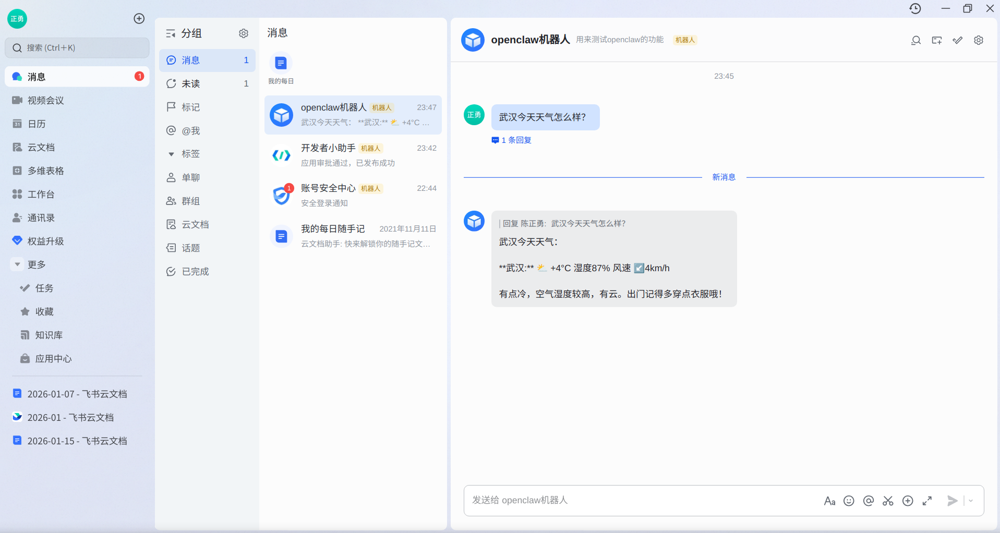

到此，可以确认 openclaw 配置成功，也成功接入到了飞书。

看到这里，你可能有疑问，就这？这不是现在所有 AI 都能做到的事情吗？

当然 openclaw 肯定不止一个简单的问答机器人，要不也不会引起那么多人的关注。只是本篇文章的主旨是介绍 openclaw 的安装配置以及飞书接入。更多更高级的玩法，需要一些配置，这其中还涉及让渡一些权限给 AI，比如文件读写，不得不谨慎一些。后续我会继续研究，欢迎关注公众号，查看更多精彩内容。

码字不易，如果觉得本篇内容不错，点个再看吧！