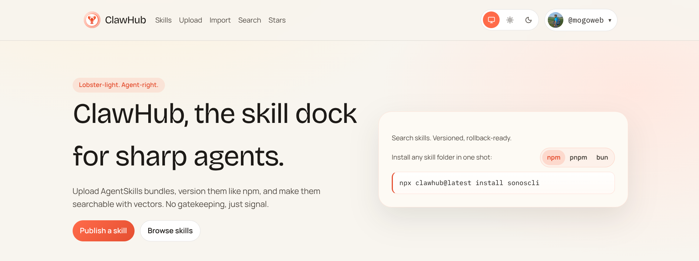
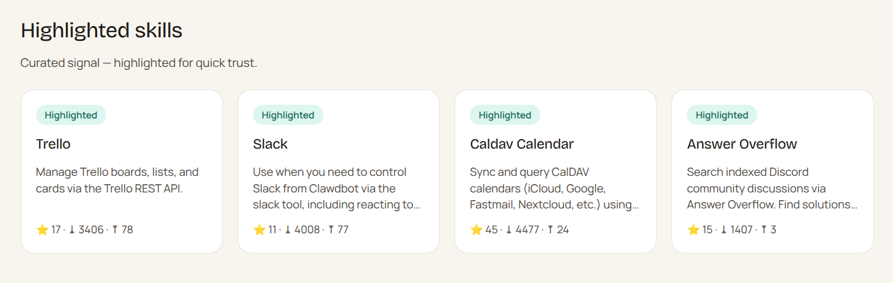
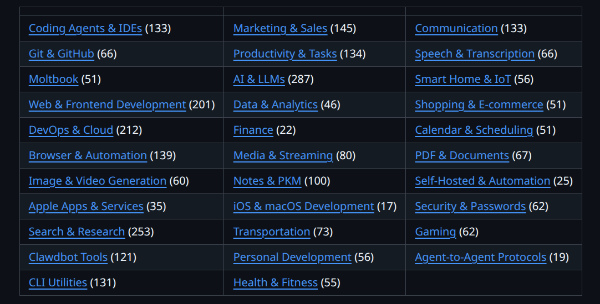

# 玩转 OpenClaw，你需要这些 Skills

上个周末，我在 deepin v25 上尝试部署了 OpenClaw，部署过程可以参考这篇文章：

 [deepin v25 下 OpenClaw 安装教程 + 飞书接入](https://mp.weixin.qq.com/s/DyAHXpX2WHM01H4f9la_fg)

随后又做了一些简单的尝试，比如——[在地铁上给OpenClaw下了几个指令，结果它真的在操作我的电脑...](https://mp.weixin.qq.com/s/vP5cdnv81l1bl8jyEfQylg)。

可能也有朋友跟着折腾了一圈之后，会有疑惑：“OpenClaw 好像也没有想象中那么厉害啊？”

这个感觉其实很正常。因为 OpenClaw 的定位，如果脱离使用场景来看，很容易被低估。正好我正在做国产操作系统相关的事情，不妨借助一个熟悉的视角 - 操作系统，来打个比方。

假设你拿到一台电脑，上面只安装了 UOS 操作系统。你可以用系统自带的文本编辑器写点简单文档，用浏览器上上网。但如果这个系统只能做到这些，你大概率也会觉得，这个操作系统“能用，但没什么用”。

真正让操作系统变得有价值的，从来不是内核本身，而是应用生态。你需要安装 WPS 来处理办公文档，安装 企业微信 和同事协作沟通，安装游戏软件用来娱乐，甚至还需要更专业的软件，完成工作。

OpenClaw 也是一样的逻辑。

OpenClaw 本身确实内置了一些基础能力，但仅依赖这些内置功能，远远发挥不出它真正的潜力。如果把 OpenClaw 类比成一个“操作系统”，那我们同样需要为它安装“应用程序”，这正是 Skills 的作用。

## Skills

要理解 OpenClaw 的 Skills，首先要明确 OpenClaw 的产品定位。

OpenClaw 是一款 完全开源、可本地运行的自主人工智能助手，具备任务理解、规划与执行的能力。从职责上看，它和操作系统有一些相似之处：

> 操作系统负责调度任务、管理资源、协调硬件，而 OpenClaw 负责 理解意图、拆解任务、调度工具并执行动作。

在这个结构中，Skills 的角色就非常清晰了。

OpenClaw 的 Skills，本质上是一组 可独立启用或禁用的功能模块，相当于为这个本地 AI 助手安装的“应用程序”或“能力插件”。
每一个 Skill 都聚焦于一个明确的功能边界，是 OpenClaw 扩展能力与构建生态的核心机制。

换一种更直观的说法：

- **OpenClaw 本体**：相当于“操作系统内核 + 基础运行环境”
- **Skills**：相当于安装在这个系统上的各种 App

OpenClaw 作为智能助手核心引擎，主要负责：

- 自主运行与任务规划
- 上下文理解与状态管理
- 对外部工具和能力的统一调度

而 Skills 则是为这个引擎持续“加装备”的方式，让它能够胜任越来越多的具体场景。

从简单的天气查询、日历管理，到更复杂的网页自动化、代码分析、图像生成，再到企业级的数据库操作、邮件自动化、内部系统对接，这些能力并不是写死在 OpenClaw 本体里的，而是通过不断安装和组合 Skills 来获得的。

这也正是 OpenClaw 真正有想象空间的地方：一个可以被你按需定制能力边界的本地智能操作系统。

##  哪里去找 Skills

那问题来了：使用 OpenClaw，一定要自己开发 Skills 吗？

大多数情况下，其实并不需要。就像你在操作系统里需要某个功能时，很少会第一时间想着去自己写一个程序，而是会下意识地去找现成的应用。

那一般去哪找？随着应用商店的普及，现在操作系统上一般通过应用商店安装软件。

比如在 UOS 上，我最常用的软件来源就是 UOS 应用商店。只要需求不是特别小众，基本都能找到合适的 App。

同样的逻辑，在 OpenClaw 这里也成立。

对于 OpenClaw 而言，对应的“应用商店”就是社区维护的 ClawHub：

> https://clawhub.ai/

ClawHub 可以理解为 OpenClaw 的官方 Skills 仓库，目前已经收录了 3,000+ Skills，而且这个数字仍在持续增长。也就是说，你能想到的大多数自动化、信息处理、开发辅助场景，往往已经有人帮你把“应用”写好了。

为什么会有这么多 Skills？

这背后，其实和一个操作系统生态能否繁荣是同一套逻辑。

之所以有越来越多开发者愿意为 OpenClaw 编写插件和 Skills，主要原因有三点：

* 社区驱动性强
  OpenClaw 完全开源，社区发展非常快。短时间内就聚集了大量关注者和贡献者，越来越多的人开始围绕真实需求编写 Skills，并主动分享出来，形成了正向循环。

* 接口标准清晰，跨场景复用成本低
  依托 Model Context Protocol（MCP） 这样的开放标准，Skills 可以方便地对接外部服务，并在不同平台（macOS / Windows / Linux）之间复用。这有点类似于：应用一旦适配了操作系统的标准 API，就可以在多个设备上运行。

* 使用门槛与定制能力并存
  普通用户可以直接“一键安装”现成 Skills；而开发者则可以使用 Node.js、Python 编写自定义 Skills，对接企业内部系统，构建专属的自动化工作流。就像操作系统一样：既能装现成 App，也允许你自己开发程序。

目前 ClawHub 收录了 3,000+ Skills，而且这个数量还在不断上升。

为什么开发者愿意为 OpenClaw 开发各种插件和 Skills，这是因为：

1.  社区驱动性强：OpenClaw开源社区发展势头迅猛，仅两个月便获得10万+GitHub星标，目前已有超过50个社区贡献的Skills，且数量仍在持续快速增长，覆盖30余个应用领域；
2.  跨场景兼容性佳：依托Model Context Protocol（MCP）开放标准，OpenClaw的Skills可无缝对接100余种外部服务，且支持跨平台使用（含Mac、Windows、Linux等系统），实现一次安装、多端复用；

3.  定制化程度高：普通用户可一键安装现成Skills，开发者可通过Node.js、Python编写自定义Skills，对接企业内部系统、搭建专属自动化工作流，充分满足个人及团队的个性化需求。

但问题也随之而来，Skills 一多，选择困难症就犯了。

目前 ClawHub 首页主要展示的是「精选」和「最新上传」的 Skills。如果你本身就带着明确需求来找能力，这种方式尚且可用，一旦目标不够清晰，仅靠浏览推荐列表，效率往往并不高。

另一方面，由于 ClawHub 允许任何人自由发布 Skills，且整体审核机制相对宽松，这也带来了一个现实问题：

Skills 的质量参差不齐，其中不乏功能简单、实现粗糙，甚至在安全性和稳定性上存在隐患的项目。对于刚接触 OpenClaw 的用户来说，直接随便装几个试试，反而可能踩坑。

这个场景其实和 GitHub 非常相似。

开源项目数量庞大，但真正成熟、可靠、值得长期使用的项目，始终只是其中的一小部分。除了直接搜索之外，很多时候我们更依赖社区中经验丰富的开发者整理出的精选列表。

OpenClaw 的 Skills 也有人专门做了系统化整理：

> https://github.com/VoltAgent/awesome-openclaw-skills

这个项目由 VoltAgent 团队维护，对 ClawHub 上的 Skills 进行了清晰分类和筛选，结构非常直观：

无论你是想用 AI 处理一些日常杂事，还是打算搭建较为复杂的开发与自动化工作流，在这里“淘现成轮子”，效率都会远高于自己从头造。

对于正在折腾 OpenClaw 的用户来说，这基本可以算是一个必看的 Skills 资源索引。

除了这种精选列表式的整理方式，还可以通过社交媒体上的热度趋势，比如在 Twitter（X）上，不少 OpenClaw 的开发者、重度用户，会持续分享自己新做的 Skills、使用案例，或者对某些热门 Skills 的评价与改进建议。某个 Skill 是否被频繁转发、讨论，往往能在一定程度上反映它的实际可用性和关注度。

就像有些 App 并不是你在应用商店看到的，而是先在社交平台上火起来，然后你才顺藤摸瓜去下载安装。

当然，你还可以在一些小众资源站点、个人仓库或社区帖子中，找到未正式收录、但在特定场景下非常好用的 Skills。比如一些针对某个细分工作流的深度定制或尚未打磨成熟，但思路很有价值的项目。

当然，这种获取方式就和在电脑上“手动下载安装软件包”一样，需要用户具备一定的判断能力，自行评估质量、安全性和维护情况。

## 小结

OpenClaw 如同操作系统的内核和灵魂，而真正决定这个系统能做什么、适合谁用、在什么场景下产生价值的，则是围绕它构建起来的 Skills 生态。寻找 Skills 的路径，就像一个成熟操作系统的应用生态：

* ClawHub：官方应用商店，覆盖面广

* 精选列表（awesome 类项目）：帮你快速过滤噪音

* 社交媒体热度趋势：发现正在“冒头”的新能力

* 小众资源站与个人仓库：挖掘更垂直、更激进的工具

如果你是长期使用 OpenClaw 的用户，往往不会只依赖单一渠道，而是像挑选软件一样，在不同来源之间交叉验证、按需取用。

你也可以关注本公众号，后续我也会持续分享一些好玩、有用、值得折腾的 OpenClaw 实践和 Skills，帮你少踩坑、多发现真正有价值的能力。
