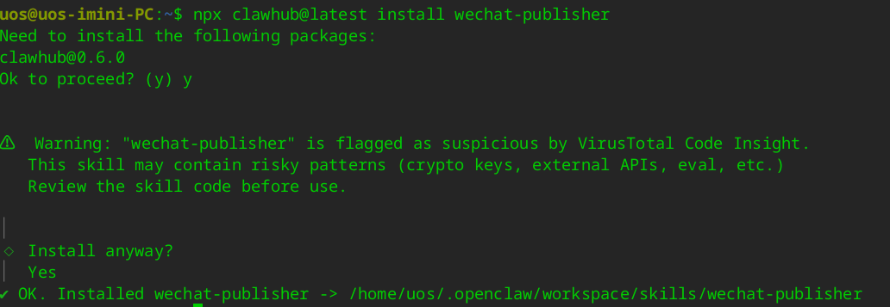
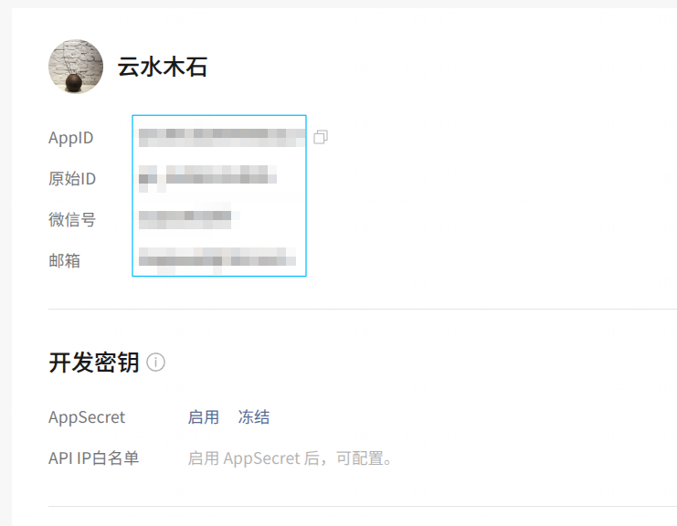
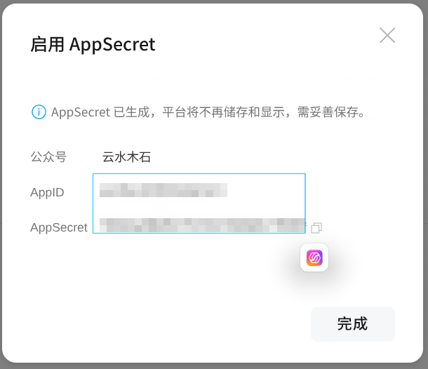
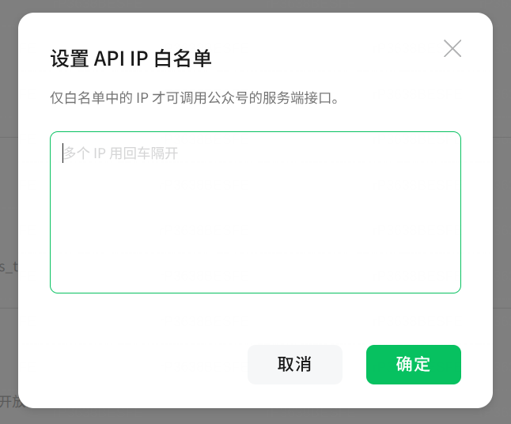
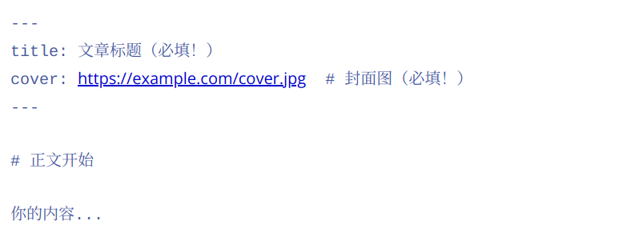
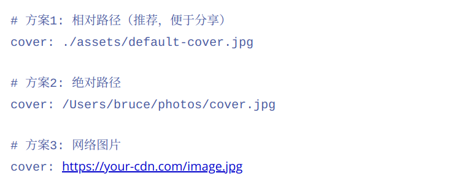

这段时间 OpenClaw 太火了，连我这个 AI 圈外人士也忍不住了。之前研究了一番 OpenClaw，还写过几篇相关的文章：

* [deepin v25 下 OpenClaw 安装教程 + 飞书接入](https://mp.weixin.qq.com/s/DyAHXpX2WHM01H4f9la_fg)
* [OpenClaw为何爆火？普通程序员能得到哪些启发？](https://mp.weixin.qq.com/s/6bpdmZJTXx6kC_ruVlvTPg)
* [在地铁上给OpenClaw下了几个指令，结果它真的在操作我的电脑...](https://mp.weixin.qq.com/s/vP5cdnv81l1bl8jyEfQylg)
* [玩转 OpenClaw，你需要这些 Skills](https://mp.weixin.qq.com/s/VlpchpH5ApwXewRI4iM-tw)

接下来该做点啥呢？感觉有点迷茫。今天看到我很敬佩的一位创作者写下的一段话：

> 其实和之前的逻辑没变，无论是什么工具，要么去做工具，要么用工具解决自己和用户的需求，瞎玩就和我们年轻的时候天天编译 Linux 内核一样，啥用没有

是啊，不能瞎玩，该让 OpenClaw 帮我做点事情了。OpenClaw 能做点什么事情呢？在浏览 ClawHub 上的 Skills 时，看到一款名为 `wechat-publisher` 的技能，是这样介绍的：

> 一键发布 Markdown 到微信公众号草稿箱。基于 wenyan-cli，支持多主题、代码高亮、图片自动上传。

不禁眼前一亮，这不正是我需要的吗？

我平常写微信公众号，都是使用 markdown 书写，写完之后再去 [mdnice](https://mdnice.com) 这个网站，渲染成微信公众号可以直接复制粘贴的格式。但由于公众号文章里的图片，不支持外链。所以我还得将图片文件一个个上传到微信公众平台的素材库。最后还要在编辑器中将文章图片一张张替换成素材库的图片。平常我的文章中会有比较多的界面截图，每次文章写完了，发布到微信公众号都要耗费不少时间。

有了这个技能，能一键发布到草稿箱，检查一下就可以发布，省事多了。

那还等什么呢？马上行动起来。

首先使用如下命令安装 `wechat-publisher`：

```
npx clawhub@latest install wechat-publisher
```


安装的时候有安全提醒，我研究了一下，这个 Skill 主要是用了 wenyan-cli 这个开源库，问题不大。

`wechat-publisher` 依赖 wenyan-cli，所以手动安装一下。

wenyan-cli 需要全局安装：

```bash
npm install -g @wenyan-md/cli
```

验证安装：

```bash
wenyan --help
```

接下来按照要求，获取微信公众号的 AppID 和 AppSceret。打开微信开发者平台网站：https://developers.weixin.qq.com/

找到公众号的 AppID。



因为之前没有启用 AppSecret，先需要启用 AppSecret。需要注意的是，启用之后平台就不再显示，需要提前保存起来，以后可能还会用到。



要能够上传图片，还需要设置 IP 白名单。这里的 IP 必须是公网 IP，平常在家通过光纤接入，或者在公司使用企业网，看到的 IP 并非公网IP。要想知道公网IP，方法很简单，打开浏览器，访问 https://ip.cn 就能查询到所使用的公网 IP。



接下来编辑 `~/.openclaw/workspace/TOOLS.md` 文件，把 AppID 和 AppSecret 添加进去：

```
export WECHAT_APP_ID=your_wechat_app_id
export WECHAT_APP_SECRET=your_wechat_app_secret
```

在这之前，可以先用 `wechat-publisher` 的发布脚本先测试一下，确保 AppID、AppSecret 以及 IP 白名单配置无误。

在运行 publisher.sh 脚本之前，确保环境变量已设置：

```
export WECHAT_APP_ID=your_wechat_app_id
export WECHAT_APP_SECRET=your_wechat_app_secret
```

接下来运行 publisher.sh 脚本，尝试一下发布文章，

```
cd ~/.openclaw/workspace/skills/wechat-publisher
./scripts/publish.sh /path/to/article.md
```

最后就是 markdown 文件的要求，文件顶部必须包含完整的 frontmatter（wenyan 强制要求）：



title 和 cover 都是必填字段！

所有图片（本地/网络）都会自动上传到微信图床。图片路径可以采用如下集中：



接下来就可以在 OpenClaw 中直接下达指令了：

```
"帮我发布这篇文章到微信公众号" + 附带 Markdown 文件路径
```

