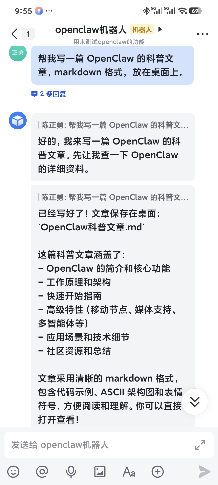
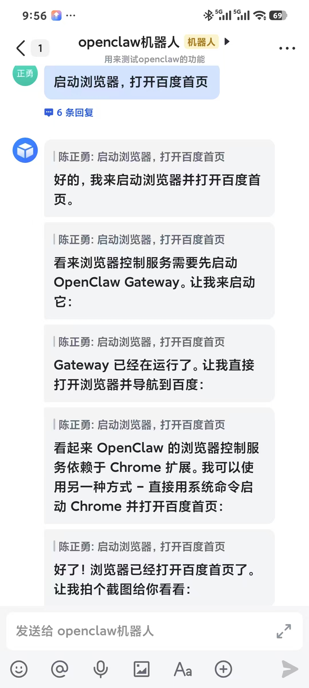
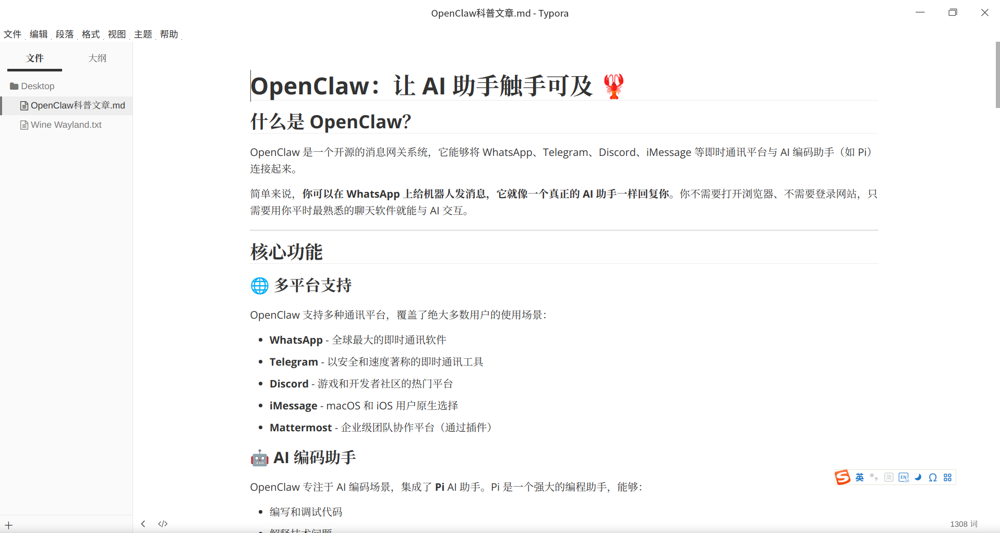
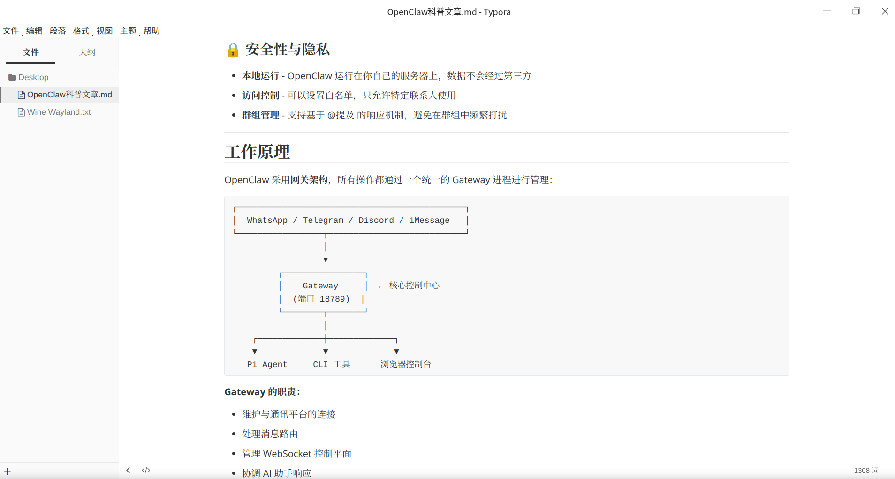

# 在地铁上给OpenClaw下了几个指令，结果它真的在操作我的电脑...

上个周末，我在自己的迷你主机上部署了 OpenClaw，具体过程已经整理成一篇文章，感兴趣的可以参考：

[deepin v25 下 OpenClaw 安装教程 + 飞书接入](https://mp.weixin.qq.com/s?__biz=MzI3NTQyMzEzNQ==&mid=2247490644&idx=1&sn=76dff1a86bd95a3d4af4426677bc1764&scene=21#wechat_redirect)

安装完成之后，其实还没来得及真正折腾什么功能，只是先把环境跑通，打算等哪天有空再研究一些更有意思的玩法。

昨天下班回家的路上，在地铁里实在无事可做，我随手打开了飞书，想着给 OpenClaw 随便下发个指令试试。毕竟这台迷你主机从家里带到办公室，并没有刻意去启动 OpenClaw 。

于是，我像和真人打招呼一样，随口问了一句：“在线吗？”

没想到，我的 OpenClaw 机器人居然时刻在线，几乎是秒回，立刻给了我一个回复：


接着，我下达了第一个正式指令：让 OpenClaw 写一篇科普文章，并将生成的文件直接保存到桌面上。



从对话反馈来看，它似乎已经顺利完成了任务。但说实话，我心里仍然有些犯嘀咕：它真的能把文件实实在在地保存到我的桌面上吗？

毕竟，以前接触过的 AI，再聪明也更多只是“顾问”角色，负责出主意、给答案，却从未真正介入过我的电脑操作，更谈不上帮我创建文件、落地执行。

我听说过一些 AI 可以自动操作浏览器，完成信息查询、订票等一整套流程。那么，OpenClaw 是否也具备类似的能力？带着这个疑问，我索性直接向 OpenClaw 问了问。


没想到，OpenClaw 会的东西还真不少。不过考虑到它部署在我的开发主机上，我并不希望它随意去点浏览器里的链接。而且根据前面的说明，一些稍微复杂的操作，还需要额外安装OpenClaw的浏览器插件。

权衡之下，我决定先不折腾那些高风险、重依赖的场景，而是给它下达了一个相对简单、可控的小任务，先看看它到底能做到什么程度。



任务显示已经完成，但说好的拍照截图却并没有发给我，这让我一时也无法确认 OpenClaw 是否真的按要求执行了。

直到今天早上到公司，打开电脑的一瞬间，屏幕上赫然就是百度首页。那一刻我才确信，这个页面，确确实实是 OpenClaw 帮我打开的。


接着去查看桌面，《OpenClaw科普文章.md》文件就摆放在桌面。


随后我又去查看了桌面，《OpenClaw 科普文章.md》文件安安静静地躺在那里。

我打开文件，看了一眼内容。出乎意料的是，文章结构完整、逻辑清晰，行文也相当克制，还有流程图。至少作为一篇科普文章，它已经是合格的。





这时，我才真正意识到：这一次，AI 不只是给了我一个答案，而是实实在在地替我把一件事情从“指令”执行到了“结果”。

惊喜之余，随之而来的其实是一点不安。

我几乎没有做任何额外配置，没有精细地划分权限，也没有为它设定复杂的安全策略，它却已经可以打开浏览器、创建文件、把内容写入到我的桌面。这意味着什么？意味着在默认状态下，它已经具备了相当程度的“动手能力”。

这和我以往使用 AI 的体验完全不同。过去的 AI，哪怕再聪明，也始终停留在“建议层面”，最多告诉你**该怎么做**；而现在的 OpenClaw，却已经能够直接**替你去做**。现在我的疑问是：

* 那它的权限边界究竟在哪里？
* 它是以什么身份在操作我的系统？
* 它能访问哪些目录，不能访问哪些目录？
* 如果我下达了一条不恰当的指令，它会不会毫无保留地照做？

更关键的是：这些能力，是我主动赋予它的，还是它在“默认配置”下就已经拥有的？

在这些问题没有彻底弄清楚之前，我决定先把 OpenClaw 停掉，只在一个相对隔离的环境里进行尝试。至少在现阶段，它更适合作为一个需要被严格约束的实验对象，而不是常驻在日常工作电脑上的“隐形助手”。

从运行方式来看，OpenClaw 是以服务的形式存在的，并且默认会在开机后自动启动，长期在后台运行。这也意味着，一旦你忘了它的存在，它依然具备随时响应指令、执行操作的能力。

在 deepin v25 下，OpenClaw 的服务名是 **`openclaw-gateway`**，而且是一个**用户级（user）systemd 服务**：
 正常情况下，它会在用户登录时启动，在用户退出时停止（除非显式开启了 `linger`，使其在无登录状态下依然常驻）。

```
$ systemctl --user status openclaw-gateway
Warning: The unit file, source configuration file or drop-ins of openclaw-gateway.service changed on disk. Run 'systemctl --user daemon-reload' to reload units.
● openclaw-gateway.service - OpenClaw Gateway (v2026.1.29)
     Loaded: loaded (/home/uos/.config/systemd/user/openclaw-gateway.service; enabled; preset: enabled)
     Active: active (running) since Wed 2026-02-04 11:35:50 CST; 1 day 8h ago
   Main PID: 1264 (openclaw-gatewa)
      Tasks: 31 (limit: 32813)
     Memory: 74.2M (peak: 1.2G swap: 407.5M swap peak: 407.7M)
        CPU: 2min 22.976s
     CGroup: /user.slice/user-1000.slice/user@1000.service/app.slice/openclaw-gateway.service
             └─1264 openclaw-gateway
```

停止服务：

```
systemctl --user stop openclaw-gateway
```

禁止开机自启（强烈建议）：

```
$ systemctl --user disable openclaw-gateway
Removed "/home/uos/.config/systemd/user/default.target.wants/openclaw-gateway.service".
```

以后如果想要使用OpenClaw，可以随时启用：

```
systemctl --user enable openclaw-gateway
```

---

OpenClaw 展现出来的能力令人兴奋，也足够震撼，但在权限边界、执行可控性、安全模型尚未完全吃透之前，把它关进一个隔离的实验环境，显然比放任它常驻后台要更理性一些。

也许不久之后，我们都会习惯身边有这样一个“能干活的 AI”。接下来我将会研究OpenClaw的能力，有哪些好玩的玩法，敬请关注！
