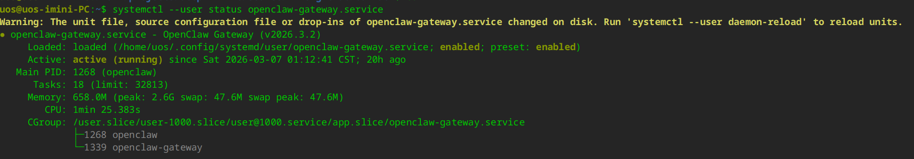
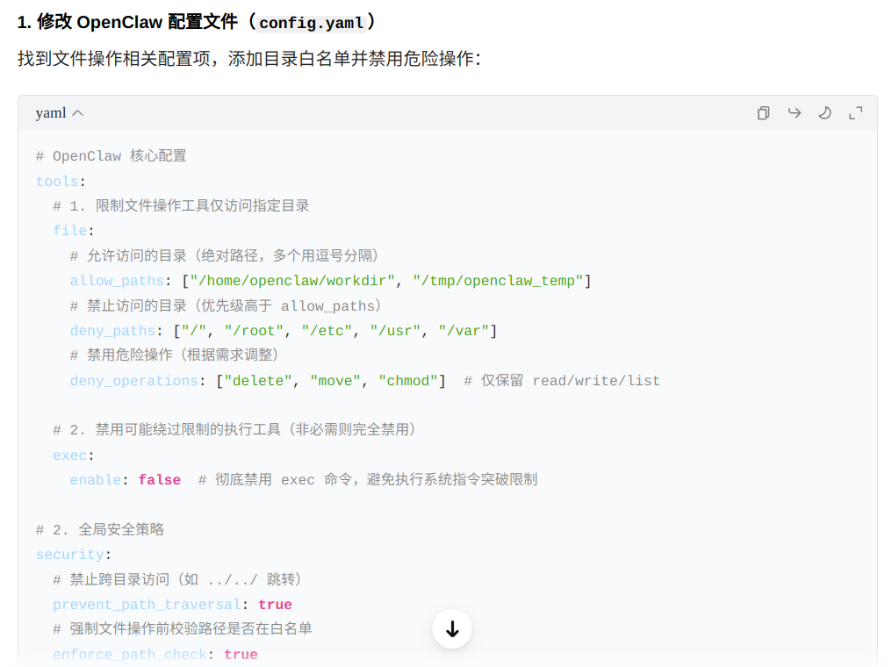

我是在今年 2 月 1 日 开始研究 OpenClaw 的。，当时写了一篇[deepin v25 下 OpenClaw 安装教程 + 飞书接入](https://mp.weixin.qq.com/s/DyAHXpX2WHM01H4f9la_fg)文章进行了记录。当时在文章中写下这样一段话：

> 总结一下安全风险：
>
> - OpenClaw 是测试阶段的业余项目，存在不稳定和安全风险。
> - 启用工具后风险更高：它可以读文件、执行操作，恶意或不当提示可能诱导其做出不安全行为。
> - 不具备基础安全能力的人不建议直接使用，尤其是在启用工具或对外暴露前，应请有经验的人协助。
>
> 所以不是专业人员，建议不要直接尝试。

因为担心安全风险，所以并没有敢在办公室部署。不过在随后一个多月的研究和实践中，我逐渐发现自己的担心其实有些过度。OpenClaw 的权限并没有想象中那么大，只要具备一定的安全意识，在日常工作环境中使用它，风险是完全可以控制的。

首先，OpenClaw 在 Linux 系统中是以 **用户级服务（user service）** 的形式运行的，因此它对文件系统的读写权限，与当前登录用户完全一致。

Linux 的权限设计本身就相当可靠。日常使用 Linux 时，我们一般不会直接以 **root 用户** 登录。对于需要系统级权限的操作，通常会通过 `sudo` 临时提权，而这个过程需要输入用户密码进行确认。

因此，OpenClaw 并没有权限直接修改系统关键文件，也不可能自行提升到 root 权限范围。换句话说，它至少不会破坏系统本身，例如导致系统无法启动或者影响系统稳定性之类的严重问题。

当然，这并不意味着完全没有风险。对于 **HOME 目录下的文件**，OpenClaw 仍然拥有完整的读写权限。通常情况下，我们的文档、代码、配置文件等都保存在用户目录中。如果误操作这些文件，虽然不至于危及整个系统，但如果工作成果被不小心删除，或者代码被改得一团糟，那也会是一件相当让人头疼的事情。

所以，即使只是普通用户权限，也依然需要保持一定的谨慎。

那么，是否可以限制 OpenClaw **只访问指定的目录** 呢？

我首先问了豆包。豆包一本正经地给出了一个看起来非常专业的方案，但经过实际验证之后发现完全不管用。

后来我又问了 ChatGPT，它也给出了一套限制方法，结果同样是错误的。

于是我又重新思考了一下：如果只运行 **经过验证的 Skills 和 Plugins**，并且避免随意安装未知插件，其实风险已经大大降低。综合权衡之后，我决定在办公电脑上也部署一套 OpenClaw。

我给这只 OpenClaw 取名 **“星期五”**。这个名字来自《鲁滨逊漂流记》。在书中，鲁滨逊把救下的野人取名为“星期五”。星期五是一个未经文明污染、本性善良、忠诚纯粹的原始人。他身上没有虚伪、贪婪、狡诈，只有真诚、服从、感恩。我希望我的**星期五**也是这样一名真诚的伙伴。

我还为**星期五**设计了一个头像：

那么，**星期五** 能为我做些什么呢？

我首先想到的是一些 **OA 相关的日常操作**，比如请假、提交加班申请、预订会议室等。公司里有位大神为内部 OA 编写了一个 skill，目前已经支持不少功能，例如：

- 批量审批加班申请 
- 提交加班申请
- 预订会议室
- 填写工时
- 查看工时符合率

这些原本需要在系统里反复点击完成的事情，现在只需要和 **星期五** 说一句话就可以完成。

当然，这只是一个开始。随着更多 skills 的出现，**星期五** 能参与的工作场景肯定还会越来越多。等我在实际工作中探索出更多有意思的用法，再继续和大家分享。
