就在前几天，开源智能体项目 **OpenClaw** 在 GitHub 上以超过 25 万+ 的 Star 数登顶榜首，超越了 Linux 和 React，成为当前 GitHub 平台上关注度最高的开源项目之一。

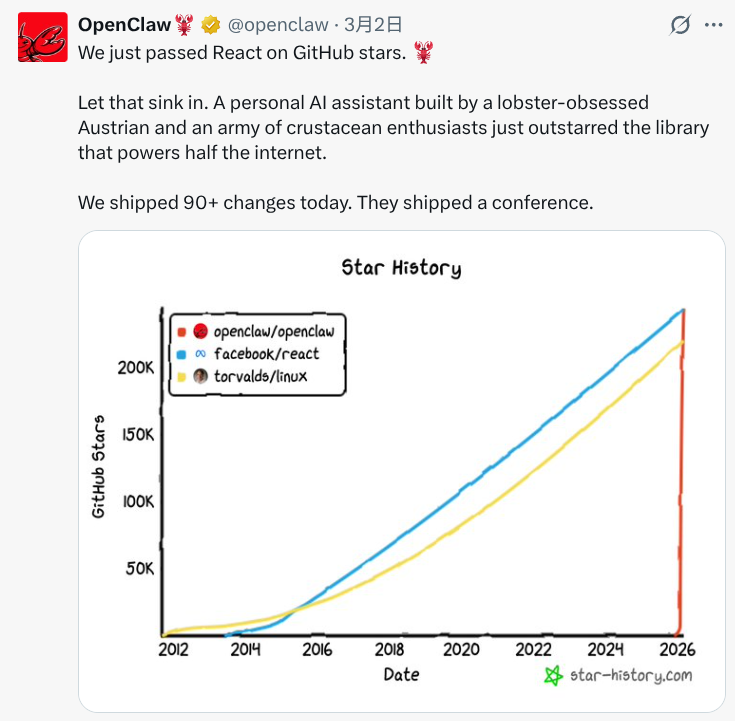

从上图中可以看到，OpenClaw 自 2025 年底启动以来，增长曲线几乎呈一条垂直曲线上升，在极短时间内积累了庞大的关注量，并迅速超过 Linux 这类长期积累的老牌开源项目。

目前，OpenClaw 已不再只是一个单点工具，而逐步演变为一个围绕 AI Agent 的生态体系。大量开发者基于 OpenClaw 构建了各类 Skills、插件与插件等工具，生态组件也呈现出爆发式增长。

然而，OpenClaw 生态快速扩张的同时，也伴随着明显的问题：项目质量参差不齐，维护标准不统一，安全审计机制滞后，甚至出现了夹带恶意代码、植入木马等安全风险。对于普通用户而言，插件与 Skills 种类繁多、信息噪声较大，如何筛选出高质量、可信赖的工具，已成为新的现实需求。在《[玩转 OpenClaw，你需要这些 Skills](https://mp.weixin.qq.com/s/VlpchpH5ApwXewRI4iM-tw)》一文中，我曾整理过几个查找 OpenClaw Skills 的渠道。但正如我们听歌可能会参考各种金曲榜，OpenClaw 生态是否也存在一份“精选工具集”？

答案是肯定的。如今，OpenClaw 已拥有专属的工具榜单平台 —— **OpenClaw Directory**。这是一个由第三方搭建的 OpenClaw 生态工具目录网站，旨在对分散的生态资源进行系统化梳理与展示。

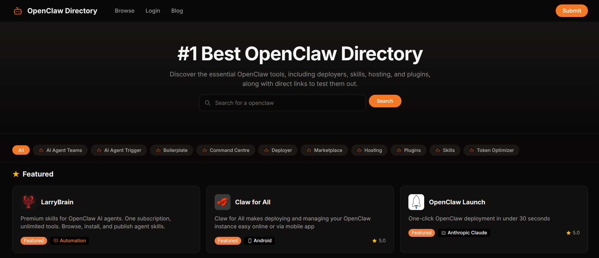

目前，OpenClaw Directory 已获得多个社区的认可。

网站现阶段共收录 40 个 OpenClaw 相关工具，并按照功能进行结构化分类，包括：

- **AI Agent Teams**：面向多 Agent 协作的解决方案
- **AI Agent Trigger**：触发 Agent 执行任务的机制或工具
- **Boilerplate**：开发模板与基础代码框架
- **Command Centre**：统一控制与管理面板
- **Deployer**：部署与发布工具
- **Marketplace**：商业推广与生态交易入口
- **Hosting**：托管与运行环境服务
- **Plugins**：增强 OpenClaw 核心能力的插件
- **Skills**：扩展特定功能的技能模块
- **Token Optimizer**：Token 使用与成本优化工具

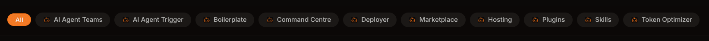

在具体工具展示层面，支持按“流行度”、“最新发布”、“评分最高”以及 “A–Z 字母序”等维度排序。

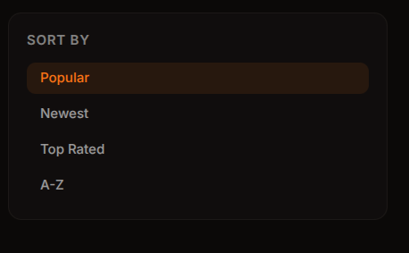

同时还支持通过“必备”、“可定制”、“开源”等标签进行筛选，进一步提升检索效率。

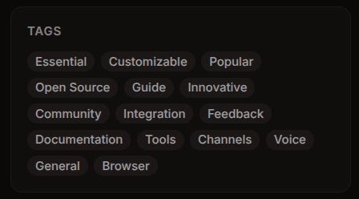

每个工具页面均标注了简介说明、核心功能、用户评分等关键信息，帮助用户在较短时间内完成技术评估与场景匹配判断，从而在复杂生态中做出更理性的选择。

介绍到这里，大家可能会有疑问，怎么才 40 个 OpenClaw 工具？是的，如果把所有的 OpenClaw 工具都罗列出来，那就不是精选集了。其实，40 个还是太多了，一个人哪有精力使用那么多。所以，这里再进一步做精选，介绍 5 款最受欢迎的 OpenClaw工具，也就是首页中展示的 Featured 工具。 

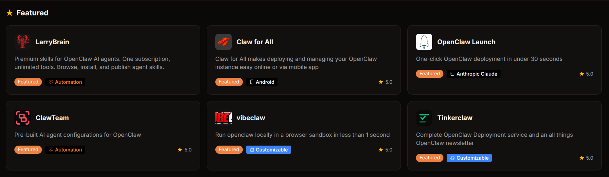

第一位貌似是一个广告位，这里略过不表，介绍余下的 5 款。

* **Claw for All**

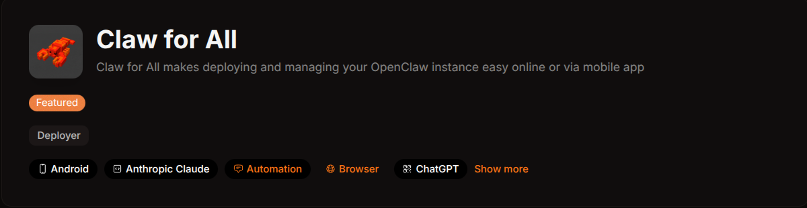

在 OpenClaw 生态不断扩展的背景下，围绕实例部署与运维管理的工具也在逐步完善。**Claw for All** 正是在这一需求下诞生的一款管理平台，专注于简化 OpenClaw 实例的部署与日常运维流程。用户无需复杂配置，即可通过网页端快速创建和管理实例；同时还支持移动端应用，实现随时随地查看与控制运行状态。整体界面设计简洁直观，对开发者和普通用户都较为友好。对于希望降低运维门槛、提升管理效率的 OpenClaw 使用者而言，Claw for All 提供了一种更轻量、更便捷的解决方案。

* **OpenClaw Launch**

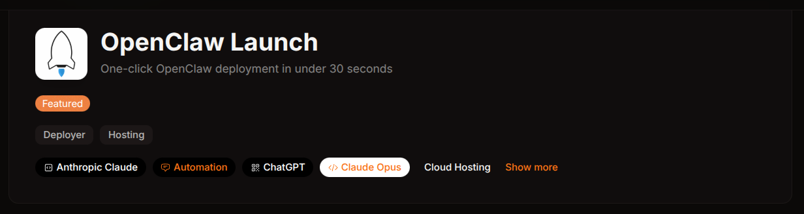

**OpenClaw Launch** 提供了一种更高效的应用发布方式。它主打“即点即用”的部署体验，通过一键操作即可完成实例创建与应用上线，整体流程可在 30 秒内完成，大幅降低部署复杂度。无论是开发者进行原型验证，还是创业团队快速上线项目，OpenClaw Launch 都能够显著提升交付效率。

在功能层面，OpenClaw Launch 强调简洁与稳定：无需繁琐环境配置，一键即可完成部署；界面设计清晰直观，降低学习成本；底层架构注重运行稳定性，保障应用持续可靠运行。同时配套提供相应的支持资源，帮助用户在使用过程中快速定位并解决问题。

对于希望加快项目落地节奏、优化工作流的用户而言，OpenClaw Launch 提供了一种更加轻量、高效的发布方案。

* **ClawTeam**

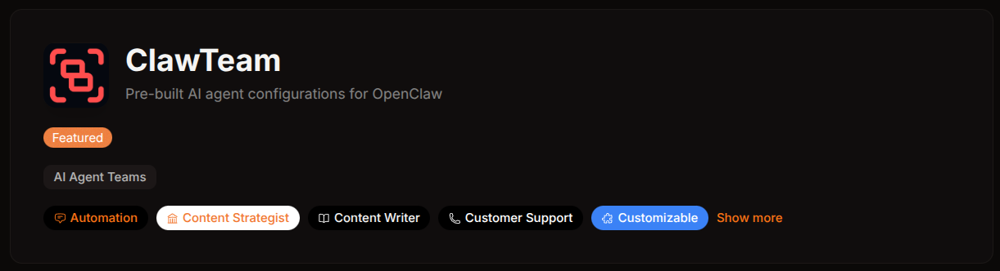

**ClawTeam** 提供了一套更具工程化思路的解决方案。它专注于为 OpenClaw 平台打造预构建的 AI Agent 配置方案，帮助用户跳过繁琐的环境搭建与参数调优环节，直接进入业务落地阶段。

ClawTeam 的核心优势在于“即用型配置”：基于实际应用场景设计好的 Agent 结构与运行参数，能够快速部署并投入使用。同时，这些配置专门针对 OpenClaw 平台进行优化，在兼容性与性能表现上更具针对性。即便是对底层架构不熟悉的用户，也可以较低成本完成 AI 能力的接入与验证。

无论是企业构建智能化流程，开发者进行功能扩展，还是研究人员开展实验探索，ClawTeam 都提供了一种更加高效、标准化的 AI Agent 部署路径。

* **vibeclaw**

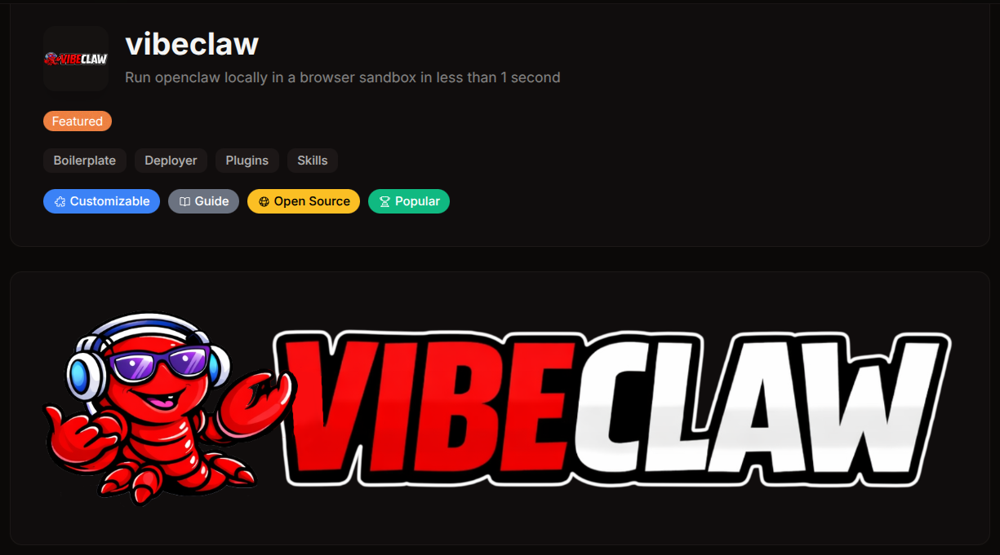

这个更神奇，号称在浏览器沙箱中本地运行OpenClaw，一秒钟部署。

**Vibeclaw** 提供了一种更加轻量且安全的运行方式。它通过浏览器沙箱技术，让用户能够在本地环境中快速启动并运行 OpenClaw，整个初始化过程甚至可以在 1 秒内完成，大幅缩短了开发与测试的准备时间。

与传统部署方式相比，Vibeclaw 强调“即开即用”的体验：无需复杂安装步骤，即可在浏览器中获得一个隔离的运行环境，同时又保持本地执行带来的高性能优势。浏览器沙箱机制也为开发过程提供了额外的安全保护，避免潜在风险影响系统环境。

对于需要频繁调试、测试 Agent 或进行快速原型开发的开发者来说，Vibeclaw 提供了一种既高效又安全的 OpenClaw 运行方案。

* **Tinkerclaw**

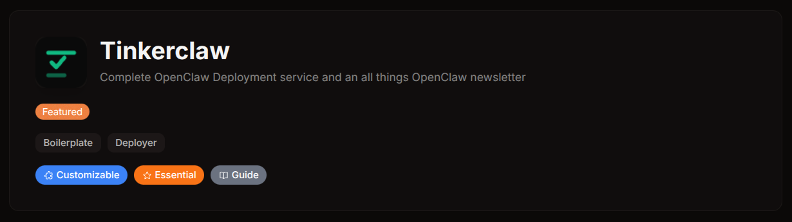

**TinkerClaw** 提供了一种更加“开箱即用”的服务型解决方案。它定位为一体化平台，帮助创业者和团队快速完成 OpenClaw AI 助手的部署、管理与扩展。与传统需要自行配置环境、调试安全策略和集成各类工具的方式不同，TinkerClaw 通过“白手套式”服务，将复杂的部署流程大幅简化，通常在 60～90 分钟内即可完成一套可投入使用的 OpenClaw 系统。

除了基础部署外，TinkerClaw 还提供工作流定制、常用业务工具集成（如邮件、日历和协作平台）、持续技术支持等服务，帮助用户将 OpenClaw 更好地融入实际业务流程。同时，其生态还在持续扩展，例如即将推出的 Mac 管理客户端、可复用的工作流模板库以及面向进阶用户的社区交流平台等。

总体来看，TinkerClaw 更像是一个围绕 OpenClaw 构建的专业化服务平台，适合希望快速落地 AI Agent 应用、但又不想在环境搭建和运维上投入过多精力的团队与个人用户。

---

看到这里，你可能会有些疑惑：为什么榜单中的热门 OpenClaw 工具，大多都与**部署**相关？其实这并不奇怪。如今 OpenClaw 这只“小龙虾”已经彻底火出圈——教程铺天盖地，各类技术群里也在持续讨论，很多人都担心错过这一波浪潮。

不过，对普通用户来说，OpenClaw 的部署和配置仍然存在一定门槛。正因如此，一些人开始提供**上门安装、远程调试小龙虾**的服务，据说生意相当火爆，甚至有人因此赚得盆满钵满。

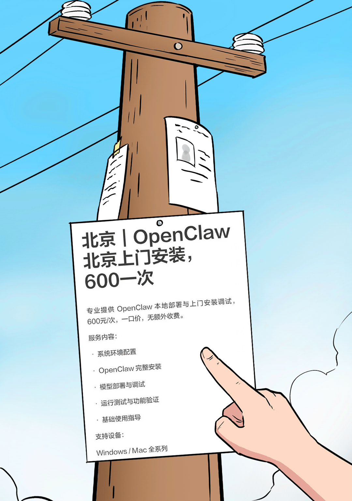

不仅是个人服务者，大公司也很快嗅到了机会。当然，它们不会采取这种“手把手安装”的方式，而是选择提供更加标准化的云服务，例如 **KimiClaw**、**MaxClaw** 等平台，主打**开通即用**的付费服务模式，让用户通过购买服务来直接使用 OpenClaw 能力。

最后，附上官网链接：https://openclawdirectory.co.uk/ 。如果你也在寻找适合自己的 OpenClaw 工具，不妨前往探索一番，也许能发现正好契合你需求的那一款。

