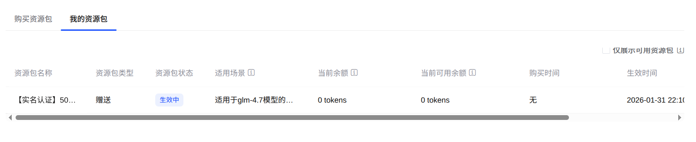
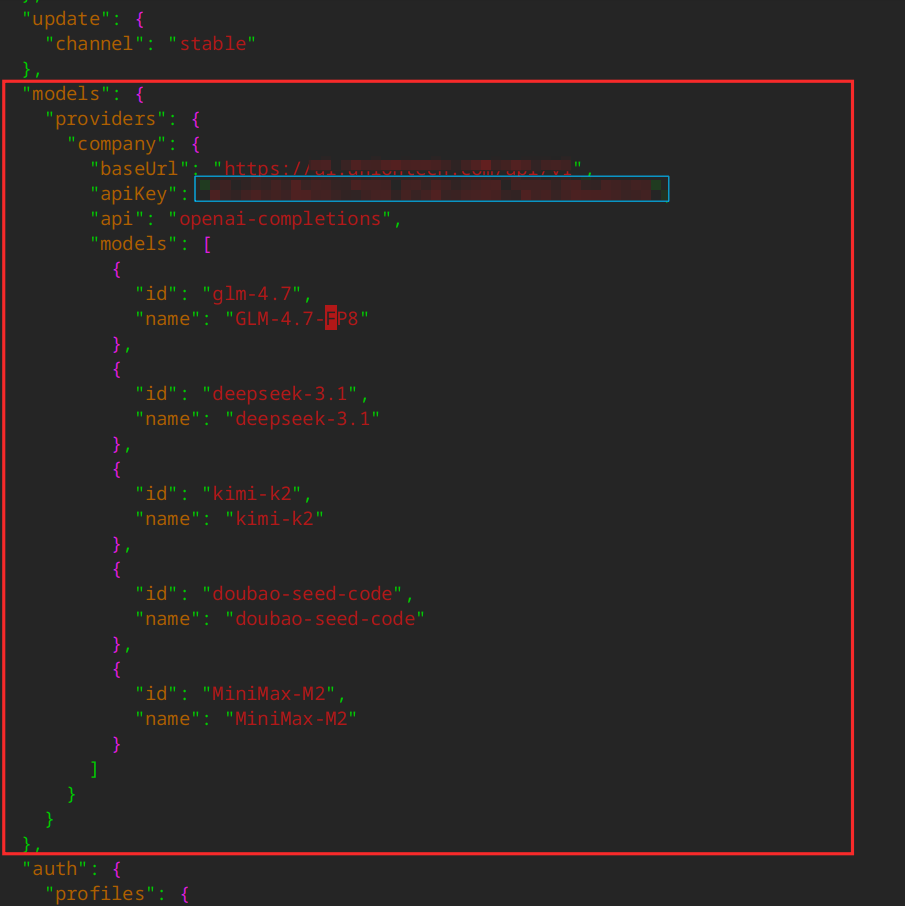
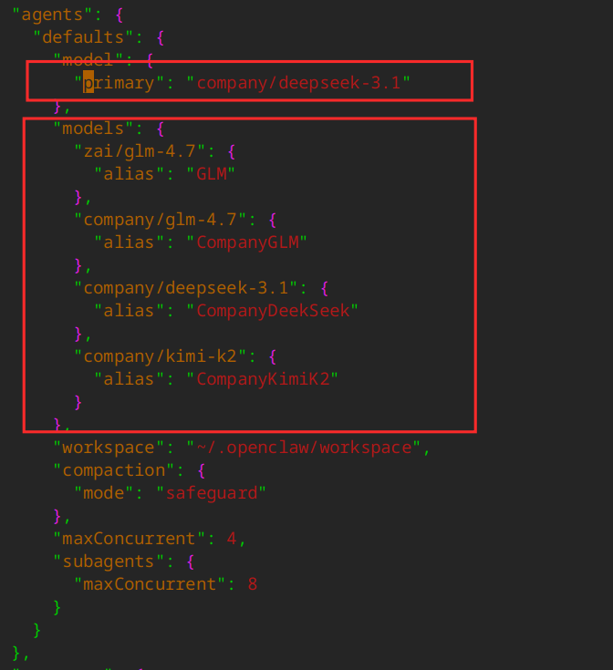
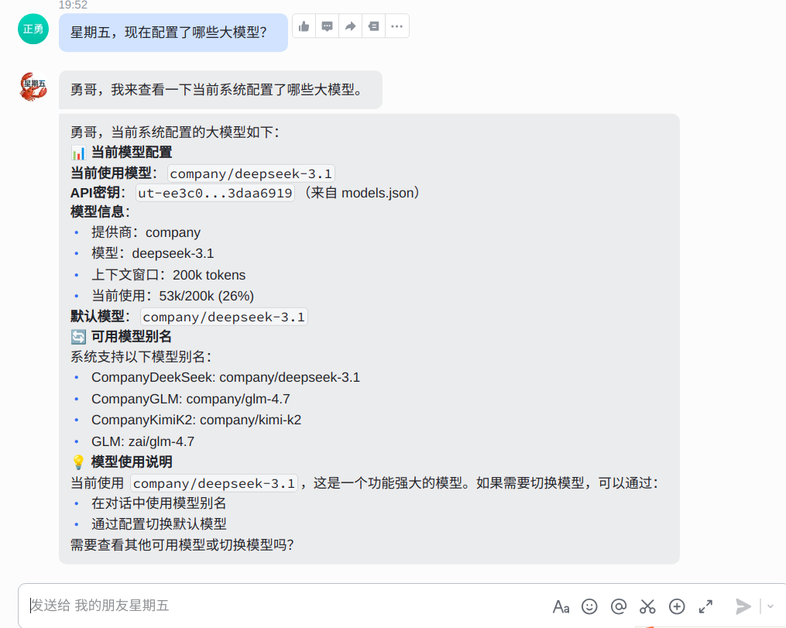

刚开始玩 OpenClaw 的时候，正好赶上智谱大模型在做活动，完成实名认证即可获得 500 万 tokens。这种羊毛肯定要薅，于是我顺手完成了认证，拿到了 GLM-4.7 体验包。

时间一晃过去一个月。实际上，这段时间里我主要是用 OpenClaw 做一些部署实验，并没有真正高频使用。和我那只名叫 **“小龙虾”** 的助手对话次数其实并不多。但令人意外的是——500 万 tokens 就这么悄悄用完了。

如果只是偶尔测试都能消耗这么快，那以后每天都用还得了？果然 tokens 用起来如流水，要是赚钱的速度也能像 tokens 消耗得这么快就好了。



考虑到以后使用 OpenClaw 的频率可能会越来越高，看起来在通过 AI 赚到钱之前，反而要先投入一笔 tokens 成本。既然如此，何不把 OpenClaw 接入到公司自建的大模型中？

按理说这应该是一件很简单的事情。公司部署的大模型提供的是 **OpenAI 兼容 API**，而几乎所有 AI 产品（包括 OpenClaw）都支持这种接口格式。

然而在实际操作时却遇到了一些波折。这里不得不吐槽一下某些 AI 工具：给出的配置方法完全不靠谱，按照它们的步骤尝试了好几次都没有成功。最后我直接翻阅了 OpenClaw 的官方文档，才终于把问题解决。

回头想想原因也很简单：**OpenClaw 的迭代速度非常快**，很多 AI 学到的还是旧版本的配置方式，并不适用于当前版本。因此，我把整个配置过程记录下来，希望能给后来者省一点时间。

其实配置的过程非常简单，只用修改 OpenClaw 的配置文件 `~/.openclaw/openclaw.json` 文件，加入如下内容：



其中，baseUrl 就是自部署大模型时对外提供的 API 接口，`apiKey` 一般分配到个人，这个需要找负责部署的人拿到。在公司内部部署，可能不止部署一个大模型，可以在 "models" 字段以数组的形式列出。“id” 是在 OpenClaw 配置文件中用来区分大模型的，需要全局唯一，"name" 则是实际部署大模型的名称。

添加完模型之后，还需要指定 **默认使用哪个模型**：



这里有一个需要注意的小细节：

这个位置下面 **也有一个** `**models**` **节点**，但它和前面定义模型的节点并不是同一个用途，不要混淆。

在这里主要做两件事：

1. 为模型设置 **别名（alias）**
2. 指定 **agent 可以使用的模型列表**

默认模型通过 `primary` 字段指定。

修改完成后，重启 OpenClaw：

```bash
openclaw gateway restart
```

可以通过命令查看 OpenClaw 当前加载的模型：

```bash
$ openclaw models list

🦞 OpenClaw 2026.3.2 (85377a2) — I don't have opinions about tabs vs spaces. I have opinions about everything else.

Model                                      Input      Ctx      Local Auth  Tags
company/deepseek-3.1                       text       195k     no    yes   default,configured,alias:CompanyDeekSeek
zai/glm-4.7                                text       200k     no    yes   configured,alias:GLM
company/glm-4.7                            text       195k     no    yes   configured,alias:CompanyGLM
company/kimi-k2                            text       195k     no    yes   configured,alias:CompanyKimiK2
```

当然，你也可以直接问 OpenClaw：



至此，自部署大模型就配置完毕，是不是非常简单？

公司部署了这么多大模型，如何切换大模型？能否根据负载情况，自动选择合适的大模型？刚刚看到新闻，OpenClaw 的最新 beta 版本中已经支持模型动态切换。不过我个人还是更倾向于使用稳定版本，因此打算等到新的 stable 版本发布之后再尝试。

如果你在使用 OpenClaw 的过程中遇到了什么问题，或者想了解更多相关技巧，欢迎留言交流。
