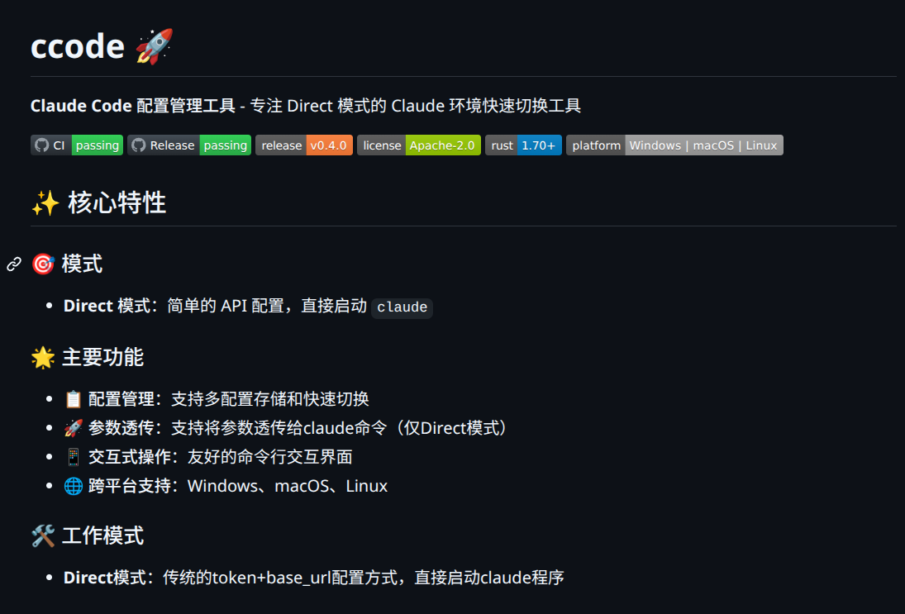

想必不少朋友已经订阅了各种 Coding Plan。如今各大厂商纷纷推出类似手机流量套餐的模型订阅服务：不同档位对应不同的 token 配额，而可用模型的范围，往往也不局限于厂商自家产品。

以我使用的火山方舟为例，其套餐中不仅包含自家的豆包系列模型，还提供了 minimax-m2.5、glm-4.7、deepseek-v3.2、kimi-k2.5 等多种第三方模型。这种模型超市式的供给，使得我们在实际开发中可以根据任务特点灵活选型。

不同模型各有优势——有的推理能力强，有的响应速度快，有的成本更低。因此，在日常使用中，我们往往需要在多个模型之间频繁切换。甚至有些用户还会额外订阅 opus、sonnet 等高阶模型，以追求更优的生成效果。

但问题也随之而来。

在 Claude Code 中，模型切换并不像 OpenClaw 或 OpenCode 那样灵活。通常，我们需要通过 `settings.json` 配置环境变量来指定模型，例如：

```
{
  "env": {
    "ANTHROPIC_BASE_URL": "https://ark.cn-beijing.volces.com/api/coding",
    "ANTHROPIC_AUTH_TOKEN": "xxxxxxxx",
    "API_TIMEOUT_MS": "3000000",
    "CLAUDE_CODE_DISABLE_NONESSENTIAL_TRAFFIC": "1",
    "CLAUDE_CODE_EXPERIMENTAL_AGENT_TEAMS": "1",
    "ANTHROPIC_MODEL": "glm-4.7",
    "ANTHROPIC_SMALL_FAST_MODEL": "doubao-seed-2.0-lite"
  }
}
```

如果需要切换模型，就必须手动修改配置文件，或者重新设置环境变量。这种方式在偶尔切换时尚可接受，但在高频切换场景下，就显得非常低效。

我之前的做法是维护多份配置文件，例如：

- `settings.json.glm`
- `settings.json.opus`
- `settings.json.minimax`

需要使用哪个模型时，就手动重命名为 `settings.json`。这种方案虽然能用，但明显不够优雅，也违背了程序员能自动绝不手动的基本原则。

于是我一度打算自己写个脚本来解决这个问题。

后来发现，同事已经做了一个更完整的小工具 **ccode**，正好覆盖了这个使用场景。

> https://github.com/junjiangao/ccode



ccode 是一个使用 Rust 编写的命令行工具，支持 Linux、Windows 和 macOS，专门用于管理 Claude Code 的多模型配置，并实现快速切换。

最简单的使用方式是直接下载预编译二进制：

```
# Linux
wget https://github.com/junjiangao/ccode/releases/latest/download/ccode-linux-x86_64
chmod +x ccode-linux-x86_64
sudo mv ccode-linux-x86_64 /usr/local/bin/ccode
```

ccode 使用 `~/.config/ccode/config.toml` 进行统一配置管理，例如：

```
default = "volc-glm4.7"

[profiles."volc-glm4.7"]
name = "volc-glm4.7"
base_url = "https://ark.cn-beijing.volces.com/api/coding"
env_key = "volc_glm4_7_key"
model = "glm-4.7"
model_haiku = "deepseek-v3.2"
model_sonnet = "kimi-k2.5"
model_opus = "glm-4.7"
comment = "火山方舟的codeplan"
```

API Key 则统一放在同级 `.env` 文件中：

```
volc_glm4_7_key="xxxx"
```

这种设计有两个明显优势：

1. 配置与 API Key 解耦，便于管理和共享配置 
2. 结构清晰，适合维护多模型、多平台组合

此外，ccode 还支持交互式添加配置：

```
ccode add volc-minimax-m2.5
🔧 添加 TOML 配置: volc-minimax-m2.5

📍 请输入 ANTHROPIC_BASE_URL (如: https://api.anthropic.com): https://ark.cn-beijing.volces.com/api/coding
🔑 请输入 ANTHROPIC_AUTH_TOKEN（将保存为 .env 的 volc_minimax_m2_5_key）: xxxxxxxx
🤖 请输入 ANTHROPIC_MODEL (可选): minimax-m2.5
🐦 请输入 ANTHROPIC_DEFAULT_HAIKU_MODEL (可选): minimax-m2.5
🎼 请输入 ANTHROPIC_DEFAULT_SONNET_MODEL (可选): minimax-m2.5
🎻 请输入 ANTHROPIC_DEFAULT_OPUS_MODEL (可选): minimax-m2.5
📦 请输入 CLAUDE_CODE_MAX_OUTPUT_TOKENS (可选，如 32000): 
📝 请输入 comment (可选): 火山方舟的codeplan-minimax模型
✅ 配置 'volc-minimax-m2.5' 已添加
```

整个过程会引导用户逐步填写参数，自动生成配置项，大幅降低使用门槛。

使用也非常简单：

```
# 列出配置（自动识别 TOML）
ccode list

# 运行（未指定 name 时使用 default）
ccode run                      # 使用 default
ccode run volc-minimax-m2.5    # 指定 profile

# 透传参数给Claude Code
ccode run minimax-m2 --version
```

本质上，ccode 做的事情很简单：在运行前动态注入环境变量，从而避免手动修改配置文件。

但正是这种简单封装，极大提升了日常使用体验。

从功能上看，ccode 并不复杂，甚至可以说是一个小工具。但它解决的问题却非常典型：当工具本身不够灵活时，用一层轻量封装来弥补能力缺口。

这类工具的价值，往往不在于技术含量有多高，而在于它是否真正贴合使用场景。

如果你也在频繁切换 Claude Code 模型，不妨试试这个小工具。虽然它不能改变你的技术栈，但至少可以让你的日常操作，少一些重复。
