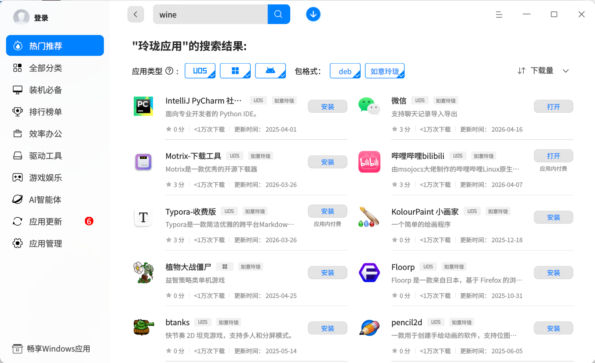
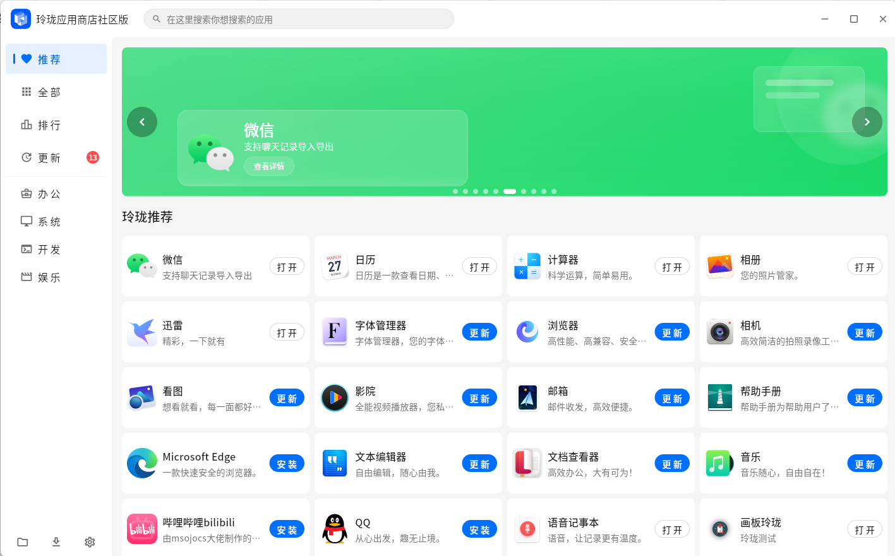

统信作为国内领先的桌面操作系统厂商，这些年一直在持续推动国产桌面操作系统的发展，努力为用户带来更加稳定、先进、易用的桌面体验。

上个月，统信正式发布了全新的 UOS V25，吸引了不少关注。不过，在推进新版本的同时，统信也并没有停止对 UOS V20 的持续维护。就在前几天，UOS V20 1070 系列又迎来了第 5 个重要更新 —— 1070u5。

作为一名长期使用 UOS V20 的用户，在收到系统升级提醒后，我也第一时间将系统升级到了 1070u5。原本以为这只是一次常规更新，但实际体验下来，我发现这次升级带来的变化，比我预想中的还要多。

翻看官方更新说明后，我发现这次升级涉及的内容非常丰富，而让我印象最深的，还是系统底层那个叫「如意玲珑」的东西迎来了一次大升级。

很多人可能第一次听到「如意玲珑」这个名字，会觉得有点陌生。简单来说，它一种应用包格式，让应用运行在隔离的运行环境中，目的是解决 Linux 长期以来最头疼的问题：

> 软件装不上、依赖冲突、不同发行版不能通用。

对于 UOS V20 来说，如意玲珑其实并不是新事物。1070 系统中，用户已经可以手动安装玲珑环境并运行玲珑应用；到了 1070u1 之后，官方开始默认集成玲珑环境，真正实现开箱即用。

而这一次，统信 UOS 1070u5 更是直接将系统内置的如意玲珑，从 1.5.6 一口气升级到了 1.10.5。

我实际体验下来，变化确实非常明显。

## 第一个感受：软件稳定多了

这次升级后，我明显感觉到，玲珑应用运行时更稳了。

官方这次提到，他们重构了容器进程管理，还加入了专用 init 进程。对于普通用户来说，这个词听起来有点技术，可以简单理解成：系统终于开始认真管理那些后台偷偷不退出的应用进程了。以前有些 Linux 软件即使关闭窗口后，后台进程其实还一直挂着，时间久了不仅占内存、占 CPU，还容易导致系统越来越卡。

而这次升级后，这类问题改善非常明显。从底层解决资源异常占用问题后，系统与应用的长期运行稳定性都提升了不少。

另外，还有一个让我比较惊喜的地方，就是 GPU 支持明显加强了。

对于 Linux 容器来说，显卡调用一直是个难题。一旦缺少 GPU 硬件加速，视频、图形类软件的性能往往会大打折扣。

这次升级后，玲珑容器对 GPU 的支持明显增强。我测试了一些影音和图形相关软件，整体流畅度相比之前提升了不少。

## 第二个感受：跨发行版兼容能力更强了

Linux 的开放性带来了丰富的发行版生态，但与此同时，也造成了生态碎片化的问题。

不同发行版之间的软件兼容性问题，一直是 Linux 生态里比较头疼的事情。

而如意玲珑现在做的一件非常重要的事，就是尽可能抹平不同 Linux 发行版之间的差异。

这次升级里，我看到几个非常关键的变化：

- 新增龙芯新世界架构支持
- AMD64、ARM64、LoongArch 自动适配
- Qt5 / Qt6 自动兼容
- UAB 打包机制重构

玲珑目前覆盖：deepin、UOS、openKylin、openEuler、Debian、Ubuntu、Fedora、Arch 等 10+ 主流 Linux 发行版，其中 deepin/UOS 最新版默认自带，其余大多可通过添加玲珑官方源安装。有了这个跨发行版兼容保证，开发者以后不用为了不同 Linux 平台反复折腾。真正开始接近：一次打包，全平台运行。

这个对于普通用户来说，特别重要。因为 Linux 生态一直最大的问题，就是碎片化。

## 第三个感受：更关注普通用户体验了

这次升级里，我特别喜欢的一点是，更加关注普通用户的真实使用体验了。

比如：

- 应用支持无感升级

  以前 Linux 更新软件，经常需要关闭应用。现在部分玲珑应用已经支持运行中平滑升级。

- 能直接读取 U 盘目录

  这个太实用了。之前玲珑容器应用访问外部目录比较麻烦，现在 U 盘文件可以直接读取，办公场景方便很多。

- 可以一键清理闲置运行时

  这个功能我觉得很多人会喜欢。Linux 用久了以后，各种运行时环境会越堆越多，现在终于能统一清理了。系统会干净很多，也能节省很多硬盘空间。

- 优化了应用安装、更新、卸载的整个流程

  针对应用明明安装成功了，但启动器图标不显示；或者安装路径里包含中文、空格、特殊字符后，程序出现无法启动、无法读取文件等兼容问题，进行了针对性修复。现在无论是安装应用、更新版本，还是卸载清理，整个过程都更加稳定顺畅，很多细节问题也被提前处理好了。

## 如何安装玲珑应用？

那么，普通用户该如何体验如意玲珑呢？

目前 UOS V20 已经开放了两大官方安装入口，无需复杂配置，上手门槛非常低。

### 1. 统信 UOS 预装官方应用商店：

将系统升级至 统信UOS 1070u5，即可在系统预装应用商店内搜索、安装、一键管理玲珑应用。

我实际体验时发现，在应用详情页右上角，可以直接切换：deb 版本和如意玲珑版本。这一点挺直观。

建议大家安装玲珑版，原因很简单：稳定、省事、不容易依赖冲突。

对于普通用户来说，这其实比什么都重要。

### 2. 玲珑应用商店社区版：

统信UOS 1070u4 及以上版本的用户，也可直接在预装的应用商店中搜索安装「玲珑应用商店社区版」，抢先体验更丰富的玲珑应用生态。

**温馨提示**：“玲珑应用商店社区版”为社区开发者自行开发及维护的版本，仍在持续迭代中。通过此商店安装玲珑应用需要打开系统的开发者模式（设置-通用-开发者选项-进入开发者模式，办公系统建议咨询IT谨慎操作）。

## 开发者可能会更开心

作为一名开发者，我看完这次更新内容后，其实更加兴奋。

因为这次工具链升级的力度非常大。

比如：

- 支持 Flatpak 转玲珑包
- 支持 deb 转玲珑包
- 支持 AppImage 转玲珑包
- 自动安装 APT 依赖
- 自动精简包体积
- 支持多语言国际化
- 开发调试更高效

这意味着以前已经做好的 Linux 软件，可以更低成本迁移到玲珑生态。

## 最后

如果你已经在使用统信 UOS，还是挺建议升级到 1070u5 体验一下的。

升级路径也很简单：

【控制中心】→【更新】→【检查更新】

完成升级后，就能直接体验新版如意玲珑运行环境。

如果你对 Linux 应用生态、国产操作系统、跨发行版兼容这些方向感兴趣，也可以了解一下如意玲珑这个项目。目前它已经适配了：

- deepin
- 统信 UOS
- Ubuntu
- Debian
- Fedora
- Arch
- openEuler

等多个主流 Linux 发行版。

相关信息：

- [如意玲珑官方网站](https://linyaps.org.cn/?utm_source=chatgpt.com)
- [官方文档中心](https://linyaps.org.cn/guide/start/whatis.html?utm_source=chatgpt.com)

