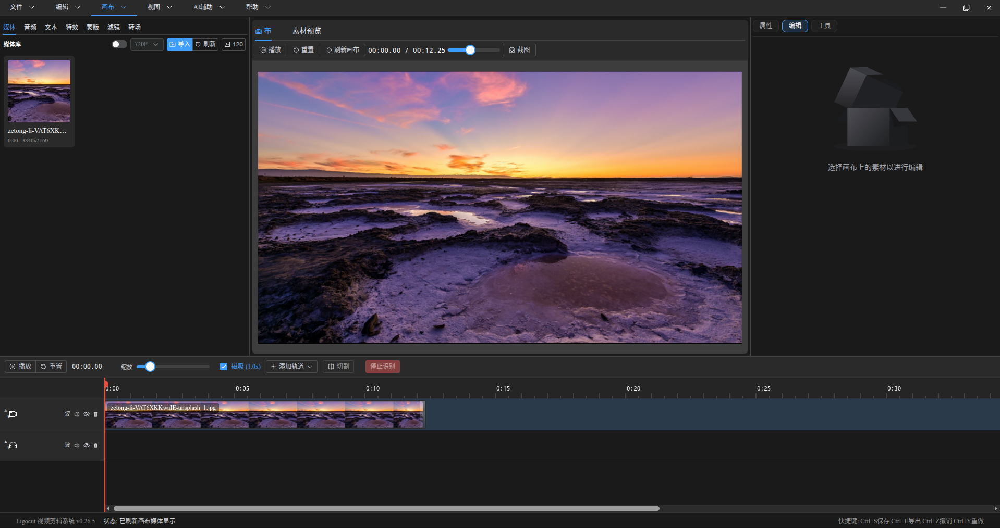

# 烧了20亿token，这位爱好者做了一款信创版的“剪映”

随着 AI 能力越来越强，一方面令人振奋，因为越来越多的工作可以交给 AI 了。另一方面也会让人感到沮丧，媒体基本上都被 AI 占领了。打开头条、公众号，大概率看到的是 AI 写的文章。

我们在工作中页越来越离不开 AI。以前使用 AI，只是简单的写写 Demo，或者写写局部的算法或者函数。自从在项目中使用 Claude Code 后，现在解 Bug，实现新功能，都交给 AI 了。去年大模型还无法驾驭 WINE 这样的复杂的大型项目。如今，借助 AI，都可以直接修改 WINE 代码，感觉以后我都不用去啃 WINE 这样庞大的源码库。

AI 越来越强之后，一方面可以提升开发效率，但另一方面，有隐隐觉得不安，这样下去，程序员还有存在的价值吗？

最近听了一期播客节目，一位嘉宾说了这样一句话：不要过多去想 AI 会如何取代自己，而应该多想想，借助 AI 还可以做哪些事，比如之前没有时间或者没有能力做的事情。

是啊，就拿国产替代系统来说，我们常常去抱怨国产系统生态不完善，很多 Windows 软件没有 Linux 版本。如今有了 AI，是不是可以做一些 Windows 平替软件。如果 AI 不能做到，这说明程序员仍然有存在的价值。如果 AI 能做到，那我们可以做的事情太多了。Windows 上那么多的软件，都值得在国产系统上重新做一遍。

当然，专业软件还得专业厂商来做移植。以前可能还会顾虑成本等因素，如今 AI 来了，移植工作可以交给 AI。如果 AI 开发的成本低到一定程度，相信很多软件厂商愿意做这样的尝试。如果每个软件应用都这样做，那不就解决了国产信创系统生态不足的大问题了吗？

个人开发者也大有可为，比如有这样一名自称 Linux 小白的用户，因为在 Linux 上没有原生的剪映可用，尝试过 Linux 下的Shotcut、Kdenlive 等软件，仍感到不满意，于是烧了 20 亿 token，开发了一款 Linux 下的“剪映”，详情见：

[我一个小白因为没有剪映，尝试烧20亿token烧出一个视频剪辑软件]()

这款软件叫**Ligocut光剪**。采用 Electron + Vue 3 + Element Plus + Vite + Golang + Node.js 技术栈，开发环境为Deepin25。看着这一长串技术，我有些晕，如果不是借助 AI，估计没有程序员会选择这么复杂的技术栈。

软件的主界面如下，有点“剪映”的味道。

我也在办公电脑上安装了这款软件，初步试用了一下，总体来说，目前软件还处在初期阶段，只有基本的视频剪辑功能，不推荐普通用户试用。如果想尝尝鲜，可以尝试一下。

目前这位开发者还没有开放源码，但已经支持龙芯、arm 架构，为国产替代舔砖加瓦，值得点赞。

