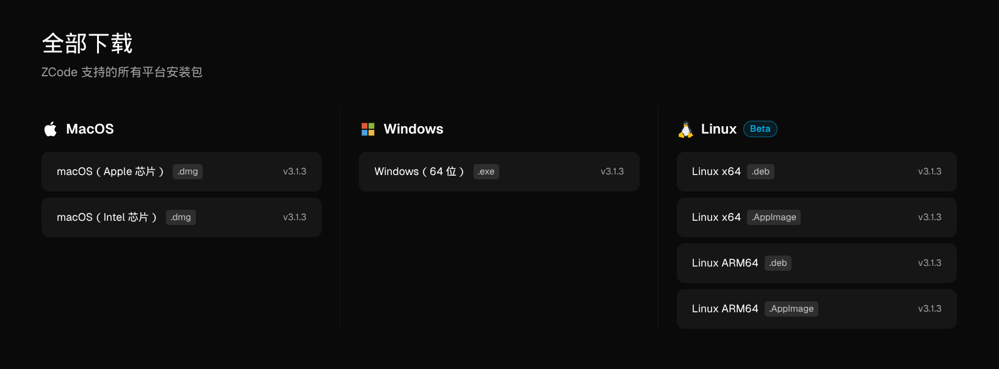
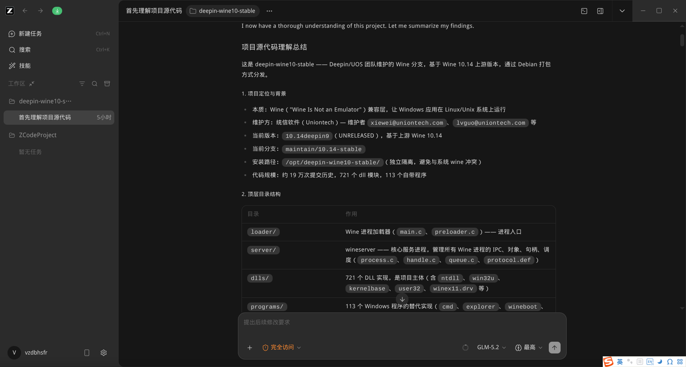
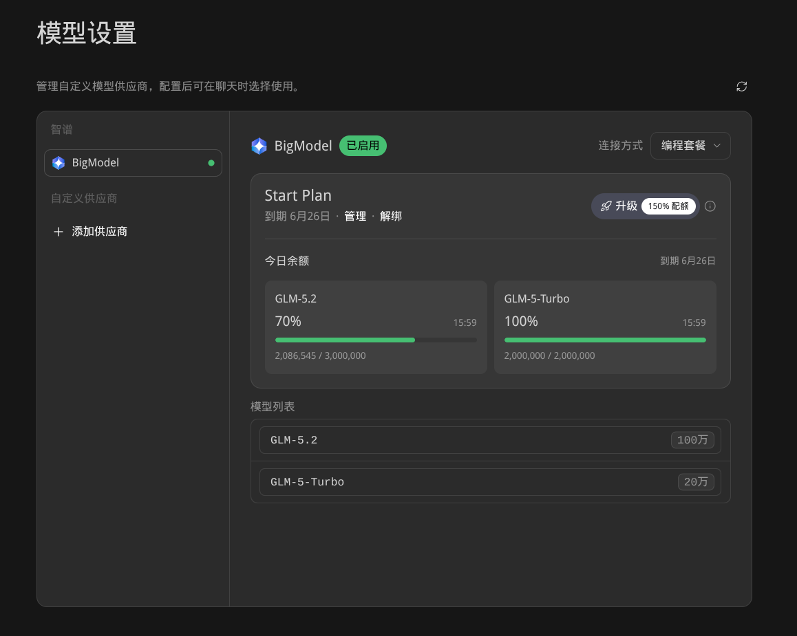

# 为了用上智谱 GLM 5.2，我下载了 ZCode

自从用上了 Claude Code 之后，我就没有再折腾 OpenCode、Codex、TRAE 之类的 AI 编程工具了。在我看来 Claude Code + GLM 大模型是绝配，虽然比不上 Claude Code + Opus 这样的组合，但胜在价格便宜，也就是我们常说的性价比高。

眼看智谱已经推出了 GLM 5.2 大模型，我还在使用 GLM 5.0。不是不愿意掏订阅费，而是智谱官方的 Code Plan 实在太难抢到。定了几次闹钟去抢，到点了官网就打不开，等能够打开了，抢购已经结束。我们公司提供的是GLM 5.0 turbo，编程能力已经很强，所以一直好奇 GLM 5.2 是不是能够和 Opus 4.7 掰掰手腕。

得知智谱推出了编程工具 ZCode 后，我决定来个曲线救国，因为 ZCode 内置了 GLM 5.2 的免费额度。虽然不能够量大管饱，但结合这公司的 GLM 5.0 模型使用，也能满足工作所需。更妙的是，ZCode 在第一时间推出了 Linux 版本，还是智谱懂程序员。目前 ZCode 的 Linux 版本支持 ARM64 和 X86_64 架构，提供 deb 和 AppImage 两种包格式：

ZCode Linux 版本还是 beta 版，但使用下来，并没有碰到什么问题，成熟度比较高。

ZCode 带有 GUI，但并非一个 IDE 工具，它并没有代码编辑器，其使用体验更接近于 CLI。

但相比 Claude Code，其模型配置、参数选择、模式切换更方便。Claude Code 使用配置文件，可以通过文本编辑器编辑，优点是灵活自由，可扩展性强，而 ZCode 则是通过菜单进行配置，对新手友好。

在模型支持上， ZCode 提供了 5 天有效期的 300 万  GLM 5.2 tokens 和 200 万 GLM 5.0-turbo tokens。之后是每天 100 万 GLM 5.2 tokens 和 20 万 GLM 5.0-turbo tokens。

