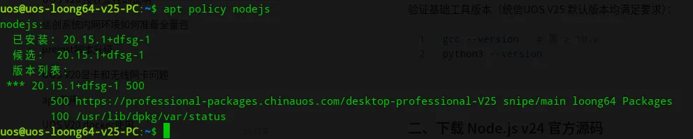
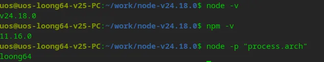

# UOS V25系统龙芯主机从源码编译安装 nodejs

在[烧了20亿token，这位爱好者做了一款信创版的“剪映”]()一文中，我提到借助 AI ，我们可以加快国产系统替代的进程。特别是对于龙芯架构的软件，从基础软件到上层软件，都非常缺乏。但是当我准备着手准备做一些龙芯架构的软件迁移时，却尴尬的发现，我在龙芯主机上根本就无法使用Claude Code、OpenCode 这样的 AI 编程工具。虽然我们可以在 X86 架构的开发机上将代码开发好，然后再同步到龙芯主机上编译、调试，但这样终归不太方便。因为Open Code 之类的 AI 可以做到写代码、编译、调试，能及时发现代码中的问题。

所以当务之急就是找一个 AI 编程工具能在龙芯主机上跑起来。研究了一下，Claude Code、OpenCode 都需要 nodejs 支持。

统信UOS V25系统已经有龙芯架构的 nodejs，安装起来也非常简单：

```
sudo apt install nodejs
```

但安装后检查版本，版本不是很新：



很多 AI 工具，比如 OpenClaw，都要求 nodejs v22 以上版本。所以我们需要在 UOS 系统上安装新版本 nodejs。

龙芯官方也维护了一套 nodejs loong64 版本，项目地址：https://github.com/loong64/node。最新支持到 nodejs V26 版本，也提供了预编译二进制包下载。但预编译的 node 在 UOS V25 上运行却提示 `GLIBC_2.38' not found。这显然是 Linux 系统的老问题，glibc 版本不兼容，如果替换系统 glibc 库，代价太大，那还是从源码直接编译吧。

## 一、安装工具链

执行以下命令安装完整编译工具链:

```
sudo apt update

# 2. 安装全部编译依赖
sudo apt install -y build-essential gcc g++ make python3 pkg-config libssl-dev zlib1g-dev libicu-dev git
```

## 二、下载 Node.js v24 源码

node 尽量选择 LTS 版本，最近比较新的 LTS 版本是 v24，所以这里选择了 v24.8.0，推荐使用国内镜像下载以提升速度，我这里使用了龙芯官方维护的源码包。

```
wget https://github.com/loong64/node/releases/download/v24.18.0/node-v24.18.0.tar.xz

# 解压源码包
tar -xzf node-v24.18.0.tar.gz
cd node-v24.18.0
```

## 三、配置编译参数

针对 loong64 架构定制编译选项，指定独立安装目录，避免覆盖系统 nodejs 包。

```
./configure \
  --dest-cpu=loong64 \
  --openssl-no-asm \
  --prefix=/usr/local/node-v24 \
  --with-intl=system-icu
```

核心参数说明：
* `--dest-cpu=loong64`：必填，指定目标架构为 LoongArch64
* `--openssl-no-asm`：关闭 OpenSSL 汇编优化，避免架构兼容性编译报错
* `--prefix=/usr/local/node-v24`：指定安装路径，方便后续管理与卸载
* `--with-intl=system-icu`：复用系统 ICU 国际化库，缩减编译体积与时间

## 四、执行编译与安装

编译耗时较长（龙芯 3A6000 约 40~60 分钟，3A5000 约 1.5 小时），请保持终端不中断。

```
make -j$(nproc)

# 编译完成后安装到指定目录
sudo make install
```
如果在 UOS V25 上编译出现如下错误：
```
In file included from ../deps/v8/third_party/highway/src/hwy/ops/scalar-inl.h:24,
                 from ../deps/v8/third_party/highway/src/hwy/highway.h:600,
                 from ../deps/v8/src/json/json-stringifier.cc:9:
../deps/v8/third_party/highway/src/hwy/ops/shared-inl.h: In instantiation of ‘struct hwy::N_SCALAR::detail::FixedTagChecker<unsigned char, 16>’:
../deps/v8/third_party/highway/src/hwy/ops/shared-inl.h:422:7:   required by substitution of ‘template<class T, long unsigned int kNumLanes> using FixedTag = typename hwy::N_SCALAR::detail::FixedTagChecker::type [with T = unsigned char; long unsigned int kNumLanes = 16]’
../deps/v8/src/json/json-stringifier.cc:3353:29:   required from ‘bool v8::internal::FastJsonStringifier<Char>::AppendStringSIMD(const SrcChar*, size_t, const v8::internal::DisallowGarbageCollection&) [with SrcChar = unsigned char; Char = unsigned char; size_t = long unsigned int; v8::internal::DisallowGarbageCollection = v8::internal::PerThreadAssertScopeEmpty<false, v8::internal::SAFEPOINTS_ASSERT, v8::internal::HEAP_ALLOCATION_ASSERT>]’
../deps/v8/src/json/json-stringifier.cc:3290:28:   required from ‘bool v8::internal::FastJsonStringifier<Char>::AppendString(const SrcChar*, size_t, const v8::internal::DisallowGarbageCollection&) [with SrcChar = unsigned char; Char = unsigned char; size_t = long unsigned int; v8::internal::DisallowGarbageCollection = v8::internal::PerThreadAssertScopeEmpty<false, v8::internal::SAFEPOINTS_ASSERT, v8::internal::HEAP_ALLOCATION_ASSERT>]’
../deps/v8/src/json/json-stringifier.cc:2510:17:   required from ‘v8::internal::FastJsonStringifierResult v8::internal::FastJsonStringifier<Char>::SerializeString(v8::internal::Tagged<v8::internal::HeapObject>, const v8::internal::DisallowGarbageCollection&) [with StringT = v8::internal::SeqOneByteString; Char = unsigned char; v8::internal::DisallowGarbageCollection = v8::internal::PerThreadAssertScopeEmpty<false, v8::internal::SAFEPOINTS_ASSERT, v8::internal::HEAP_ALLOCATION_ASSERT>]’
../deps/v8/src/json/json-stringifier.cc:2533:47:   required from ‘v8::internal::FastJsonStringifierResult v8::internal::FastJsonStringifier<Char>::TrySerializeSimpleObject(v8::internal::Tagged<v8::internal::Union<v8::internal::Smi, v8::internal::HeapNumber, v8::internal::BigInt, v8::internal::String, v8::internal::Symbol, v8::internal::Boolean, v8::internal::Null, v8::internal::Undefined, v8::internal::JSReceiver> >) [with Char = unsigned char]’
../deps/v8/src/json/json-stringifier.cc:3141:38:   required from ‘v8::internal::FastJsonStringifierResult v8::internal::FastJsonStringifier<Char>::SerializeObject(v8::internal::Tagged<v8::internal::Union<v8::internal::Smi, v8::internal::HeapNumber, v8::internal::BigInt, v8::internal::String, v8::internal::Symbol, v8::internal::Boolean, v8::internal::Null, v8::internal::Undefined, v8::internal::JSReceiver> >, const v8::internal::DisallowGarbageCollection&) [with Char = unsigned char; v8::internal::DisallowGarbageCollection = v8::internal::PerThreadAssertScopeEmpty<false, v8::internal::SAFEPOINTS_ASSERT, v8::internal::HEAP_ALLOCATION_ASSERT>]’
../deps/v8/src/json/json-stringifier.cc:3480:43:   required from here
../deps/v8/third_party/highway/src/hwy/ops/shared-inl.h:368:27: error: static assertion failed: Too many lanes
  368 |   static_assert(kNumLanes <= HWY_LANES(T), "Too many lanes");
```

需要打上如下补丁：

```
--- a/deps/v8/src/json/json-stringifier.cc
+++ b/deps/v8/src/json/json-stringifier.cc
@@ -3285,9 +3285,15 @@
 bool FastJsonStringifier<Char>::AppendString(
     const SrcChar* chars, size_t length,
     const DisallowGarbageCollection& no_gc) {
-  constexpr int kUseSimdLengthThreshold = 32;
-  if (length >= kUseSimdLengthThreshold) {
-    return AppendStringSIMD(chars, length, no_gc);
+  // The SIMD path uses FixedTag<SrcChar, 16>, which requires at least 16 lanes
+  // and does not compile under HWY_SCALAR (where HWY_LANES(T) == 1). Skip it on
+  // the scalar target and fall back to the SWAR path, which is faster there
+  // anyway (it processes 4 bytes per iteration vs. 1 lane for scalar SIMD).
+  if constexpr (HWY_TARGET != HWY_SCALAR) {
+    constexpr int kUseSimdLengthThreshold = 32;
+    if (length >= kUseSimdLengthThreshold) {
+      return AppendStringSIMD(chars, length, no_gc);
+    }
   }
   return AppendStringSWAR(chars, length, 0, 0, no_gc);
 }
```

## 五、配置环境变量并验证

将 Node.js 可执行路径加入系统 PATH

```
echo 'export PATH=/usr/local/node-v24/bin:$PATH' >> ~/.bashrc
source ~/.bashrc
```

验证安装结果：



## 六、npm 基础优化配置

### 1. 配置国内镜像源，大幅提升包下载速度：
```
npm config set registry https://registry.npmmirror.com
```
### 2. 配置用户级全局目录，避免 root 权限问题：
```
mkdir -p ~/.npm-global
npm config set prefix '~/.npm-global'
echo 'export PATH=~/.npm-global/bin:$PATH' >> ~/.bashrc
source ~/.bashrc
```

至此，loong64 架构的 nodejs v24 版本就构建成功了，这扫清了在龙芯主机上运行 AI 工具的一个拦路虎。但升级了 node，是不是能够像在别的平台上那样使用 npm -i <package> 就可以安装了呢？答案是，没有那么简单，因为即使是 nodejs 应用，不针对 loong64 架构构建包，一样是无法安装的。所以接下来还需要从源码编译 OpenCode。这个留在下一篇文章再展开，敬请关注！