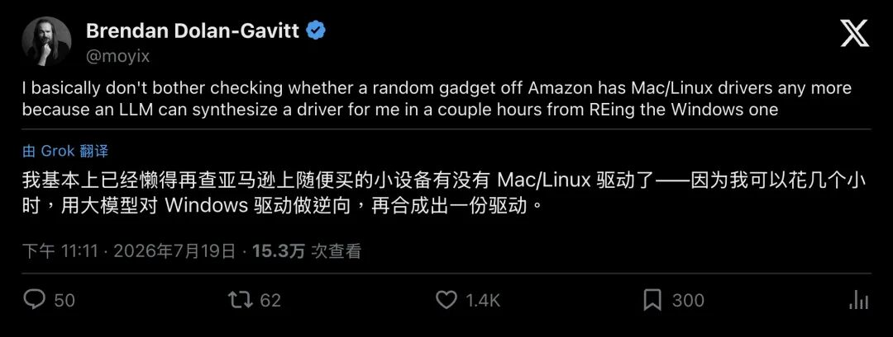

# AI破解闭源驱动壁垒：数小时完成Windows驱动转Linux源码，能否终结国产化系统适配难题？

在信创全面落地的大背景下，操作系统国产化改造已深入金融、电信、医疗等核心行业。随着深入行业用户，也面临着越来越大的挑战，比如医疗场景改造尤为棘手：医院内读卡终端、扫码设备、专用诊疗仪器等大量外设与业务系统，常年依托Windows生态搭建，形成了高度固化、深度绑定的运行体系。对于医院等行业用户而言，国产化并非简单替换硬件与系统，**承载核心业务的软件系统与外设驱动，才是国产化迁移的最大痛点**。

这类专属业务系统与硬件适配难度极高：各类外设驱动均由硬件厂商独家开发，多数老旧设备无法对接原厂团队，且厂商普遍缺乏适配国产系统与Linux生态的意愿，适配主动权完全不可控。同时，大量存量业务软件存在开发商无法找到的问题，即便顺利对接开发方，改造、适配产生的高额成本如何分摊，也是行业长期悬而未决的难题。

针对这一难题，国产操作系统厂商普遍采用WINE兼容方案降本增效。该技术通过重构Windows API接口，搭建跨平台兼容层，实现Windows业务软件无需改码、直接运行于国产Linux系统，大幅降低了业务迁移门槛。但WINE存在致命短板：**仅能兼容上层应用，无法解决底层闭源驱动适配问题**。目前仅有标准化USB HID通用设备可原生适配Linux，大量行业专属、老旧设备的私有Windows驱动，始终无法通过兼容方案实现落地。

最近看到一个帖子，发帖的是Brendan Dolan-Gavitt，网名 moyix ，前纽约大学副教授、现任AI安全研究员，长期混迹逆向工程与程序分析圈子，内容是这样的：

> 我买亚马逊上的杂牌外设，基本不再检查有没有Mac或Linux驱动了。因为大语言模型可以在几个小时内，从Windows驱动逆向合成出一份能用的驱动。

看到这则消息，我的第一反应是，国产信创化改造有救了。长期以来，Linux硬件适配生态处于弱势地位，硬件厂商大多仅开发Windows专属驱动，且仅对外提供编译后的二进制文件，开发者无从二次开发，逆向适配还存在极高的版权风险。

传统人工逆向依赖Ghidra、IDA等专业工具，将二进制文件还原为伪代码，不仅门槛极高、耗时漫长，所以仅有热门设备能获得开源社区维护适配，绝大多数小众、行业专用设备长期处于无适配状态。

而moyix的方案依托AI重构逆向流程：先通过工具完成驱动二进制反编译，再交由大模型智能解析晦涩的伪代码，快速生成适配Linux、macOS的完整驱动代码。以往专业团队数月才能完成的逆向适配工作，如今数小时即可完成初稿，适配效率实现质的飞跃。

以 moyix 在业界的影响力，本来没有那么大的说服力。但 Eric S. Raymond 出来现身说法，分量就不一样了。这位写过《大教堂与集市》的人，是开源运动史上最具影响力的布道者之一。他甚至更进一步：

> 无需预先反编译，直接投喂Windows驱动二进制文件，前沿大模型即可输出可读、可用的完整源码。

他通过实操验证了技术可行性：将DOS时代的老旧二进制程序输入大模型，成功还原出规范的Pascal源码，并通过AI二次编译为可正常运行的Rust代码，他甚至断言：

> 二进制驱动的保密壁垒已然崩塌。

当然，这项技术目前仍存在明显局限，尚未达到商用成熟度。驱动代码直接关联系统内核，容错率极低，AI生成代码稍有偏差，轻则设备无法识别调用，重则触发内核崩溃，现阶段无法实现一键生成完美驱动。

但不可否认，AI逆向已经为行业开辟出标准化、可落地的驱动适配路径：
1.  获取原生Windows驱动二进制文件；
2.  通过反编译工具梳理程序逻辑、函数边界、设备传输协议等核心数据；
3.  整合伪代码、设备抓包数据与官方接口文档，输入大语言模型；
4.  由AI生成Linux内核驱动模块与配套程序，或先解析设备协议、再迭代生成完整驱动代码；
5.  人工完成代码编译、真机调试与性能测试。

AI替代人工完成了枯燥、高难度的逆向解析工作，让研发人员聚焦于核心的调试优化环节。随着大模型持续迭代，生成代码的稳定性、完整性将不断提升，未来有望实现全自动、零调试的驱动适配。

与此同时，**法律合规争议随之而来**。比如，为规避版权风险，WINE项目始终恪守净室开发原则，严禁逆向拆解Windows二进制文件、参考未公开私有源码。而当前AI逆向闭源驱动的行为，合法性仍处于行业争议阶段。

即便存在合规争议，技术变革已然不可逆。当逆向适配的周期从数月压缩至数小时，硬件厂商依靠闭源驱动构筑的技术壁垒彻底松动。这项AI技术突破，精准破解了国产操作系统落地的最大堵点，或将成为操作系统国产化改造的关键破局之力。