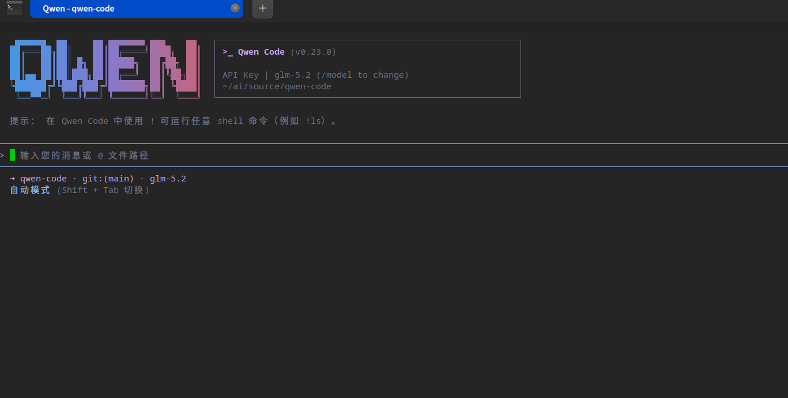

# 终于搞定龙芯架构的编程智能体 CLI

在前面的一篇文章《[AI破解闭源驱动壁垒：数小时完成Windows驱动转Linux源码，能否解决国产化系统适配难题？](https://mp.weixin.qq.com/s/pXsVMRgayIdpKCuOk0Dgpg)》介绍过，借助于 AI，可以极大提升 Windows 驱动转 Linux 驱动的开发效率。同样，国产 CPU，比如龙芯、申威等架构，生态缺乏问题更加严重，按照这样的思路，借助于 AI，我们也可以快速增加开源软件对龙芯架构的支持。但我打算在龙芯架构 UOS 系统上开发时，却尴尬的发现，Open Code、Codex、Claude Code 均没有提供龙芯架构的软件包，就连国内的 TRAE、Qwen、CodeBuddy 等等，同样没有针对龙芯架构开发。所以我们首先需要解决 AI 编程工具的开发。

在《[UOS V25系统龙芯主机从源码编译安装 nodejs](https://mp.weixin.qq.com/s/HExD9gJ-8dtVW_wIOUEMcQ)》这篇文章中，介绍了如何编译龙芯架构的 nodejs，有了这一基础，我们就可以编译龙芯架构基于 nodejs 的软件了。我先考虑的是移植 Open Code，这是一款开源软件，我在工作中也是使用它。但咨询 AI，给的建议是不要移植 Open Code，因为新版本的 Open Code 采用了 bun 技术栈。如果要移植 Open Code，那就需要先移植龙芯架构的 bun。而目前龙芯社区并没有做 bun 的移植，自己去移植起来会比较麻烦。更好的选择是基于 nodejs 技术的开源编程智能体。

经过一番调查，我最终选择了qwen-code CLI。首先它是开源的，其次它出自国内的阿里通义千问，国内 AI 第一梯队，有技术实力，项目品质有保障。下面就总结一下 qwen-code CLI 在龙芯架构 UOS v25 上的移植。

1. 需要确保 nodejs 版本为 22+ 版本，UOS v25 系统的 nodejs 版本是 20 版本，不满足要求。请参考《[UOS V25系统龙芯主机从源码编译安装 nodejs](https://mp.weixin.qq.com/s/HExD9gJ-8dtVW_wIOUEMcQ)》，先升级 nodejs。

```bash
uos@uos-loong64-v25-PC:~$ node -v
v24.18.0
```

2. 克隆 qwen-code 源码：

```
git clone https://github.com/QwenLM/qwen-code.git # Or your fork's URL
cd qwen-code
```

3. 安装 `package.json` 中定义的依赖项以及根依赖项：

```
npm install
```

由于 loong64 架构的生态不够完善，自然会碰到问题，比如如下这个问题：

```
npm notice run @qwen-code/web-shell@0.23.0 build
npm notice run vite build && vite build --config vite.lib.config.ts && tsc -p tsconfig.lib.json
failed to load config from /home/uos/ai/source/qwen-code/packages/web-shell/vite.config.ts
error during build:
Error: Cannot find module '../lightningcss.linux-loong64-gnu.node'                                                                                                                                                 
Require stack:                                                                                                                                                                                                     
- /home/uos/ai/source/qwen-code/node_modules/lightningcss/node/index.js                                                                                                                                            
    at Module._resolveFilename (node:internal/modules/cjs/loader:1517:15)                                                                                                                                          
    at wrapResolveFilename (node:internal/modules/cjs/loader:1071:27)                                                                                                                                              
    at defaultResolveImplForCJSLoading (node:internal/modules/cjs/loader:1095:10)                                                                                                                                  
    at resolveForCJSWithHooks (node:internal/modules/cjs/loader:1122:12)                                                                                                                                           
    at Module._load (node:internal/modules/cjs/loader:1294:5)                                                                                                                                                      
    at wrapModuleLoad (node:internal/modules/cjs/loader:255:19)                                                                                                                                                    
    at Module.require (node:internal/modules/cjs/loader:1617:12)                                                                                                                                                   
    at require (node:internal/modules/helpers:153:16)                                                                                                                                                              
    at Object.<anonymous> (/home/uos/ai/source/qwen-code/node_modules/lightningcss/node/index.js:20:12)                                                                                                            
    at Module._compile (node:internal/modules/cjs/loader:1871:14)                                                                                                                                                  
npm error Lifecycle script `build` failed with error:
npm error code 1
npm error path /home/uos/ai/source/qwen-code/packages/web-shell
npm error workspace @qwen-code/web-shell@0.23.0
npm error location /home/uos/ai/source/qwen-code/packages/web-shell
npm error command failed
npm error command sh -c vite build && vite build --config vite.lib.config.ts && tsc -p tsconfig.lib.json
node:internal/errors:985
  const err = new Error(message);
              ^

Error: Command failed: npm run build --workspace=packages/web-shell
    at genericNodeError (node:internal/errors:985:15)
    at wrappedFn (node:internal/errors:539:14)
    at checkExecSyncError (node:child_process:925:11)
    at execSync (node:child_process:997:15)
    at file:///home/uos/ai/source/qwen-code/scripts/build.js:92:3
    at ModuleJob.run (node:internal/modules/esm/module_job:439:25)
    at async node:internal/modules/esm/loader:643:26
    at async asyncRunEntryPointWithESMLoader (node:internal/modules/run_main:101:5) {
  status: 1,
  signal: null,
  output: [ null, null, null ],
  pid: 10499,
  stdout: null,
  stderr: null
}
```

这是由于 nodejs 组件并非都是 ts 库，有些组件库是使用原生技术开发，而它们又没有提供龙芯架构的支持。比如上面这个 lightningcss 库，就是使用原生技术开发，但没有提供龙芯架构的包。解决的方法也简单，就是找到龙芯社区的移植版本，直接下载编译好的loong64架构二进制文件：

```
https://github.com/loong64/lightningcss/releases/tag/v1.33.0
```

选择 lightningcss-linux-loong64-gnu-1.33.0.tgz 文件。解压，将其中的 lightningcss.linux-loong64-gnu.node 文件放到 node_modules/lightningcss 目录下。

同样，如果碰到这个错误：

```
failed to load config from /home/uos/ai/source/qwen-code/packages/web-shell/vite.config.ts
error during build:
Error: Cannot find native binding. npm has a bug related to optional dependencies (https://github.com/npm/cli/issues/4828). Please try `npm i` again after removing both package-lock.json and node_modules directory.                                                                                                                                                                                                                
    at Object.<anonymous> (/home/uos/ai/source/qwen-code/node_modules/@tailwindcss/oxide/index.js:573:11)                                                                                                          
    at Module._compile (node:internal/modules/cjs/loader:1871:14)                                                                                                                                                  
    at Object..js (node:internal/modules/cjs/loader:2002:10)                                                                                                                                                       
    at Module.load (node:internal/modules/cjs/loader:1594:32)                                                                                                                                                      
    at Module._load (node:internal/modules/cjs/loader:1396:12)                                                                                                                                                     
    at wrapModuleLoad (node:internal/modules/cjs/loader:255:19)                                                                                                                                                    
    at loadCJSModuleWithModuleLoad (node:internal/modules/esm/translators:372:15)                                                                                                                                  
    at ModuleWrap.<anonymous> (node:internal/modules/esm/translators:244:9)                                                                                                                                        
    at ModuleJob.run (node:internal/modules/esm/module_job:439:25)                                                                                                                                                 
    at async node:internal/modules/esm/loader:643:26                                                                                                                                                               
npm error Lifecycle script `build` failed with error:
```

同样去 https://github.com/loong64/tailwindcss/releases 下载编译好的二进制包：tailwindcss-oxide-linux-loong64-gnu.tgz，解压，将其中的 tailwindcss-oxide.linux-loong64-gnu.node 文件复制到 node_modules/@tailwindcss/oxide 目录下。

4. 构建整个项目（所有软件包）：

```
npm run build
```

该命令通常会将 TypeScript 编译为 JavaScript，打包静态资源，并完成各软件包的运行前置准备工作。关于构建过程内部执行逻辑的更多细节，请参考 `scripts/build.js` 以及 `package.json` 中的脚本配置。

5. 启动 qwen-code

```
npm run build
```

就可以看到 Qwen Code CLI 的界面了：



至此，龙芯架构的编程智能体就有了，接下来就可以使用它来大展拳脚，做出更多软件的龙芯架构移植版本了。

如何破局龙芯架构的生态问题，欢迎留言讨论。

